# dooray-cli 명령 동작 흐름

이 문서는 명령 입력이 검증, 분기, API 호출을 거쳐 출력으로 바뀌는 경로를 정리한다. 명령 문법과 옵션은 README.md, 에이전트의 명령 선택 기준은 skills/dooray-cli/SKILL.md, 결정 근거와 기각한 대안은 docs/adr/에서 다룬다.

## 최초 설정: `dooray setup`

### `setup`

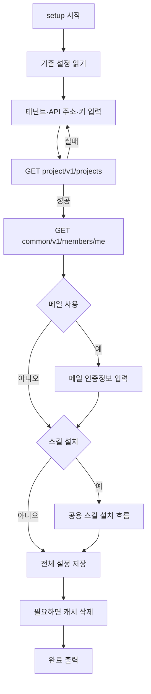
```mermaid
flowchart TD
    A["setup 시작"] --> B["기존 설정 읽기"]
    B --> C["테넌트·API 주소·키 입력"]
    C --> D["GET project/v1/projects"]
    D -->|성공| E["GET common/v1/members/me"]
    D -->|실패| C
    E --> F{"메일 사용"}
    F -->|예| G["메일 인증정보 입력"]
    F -->|아니오| H{"스킬 설치"}
    G --> H
    H -->|예| I["공용 스킬 설치 흐름"]
    H -->|아니오| J["전체 설정 저장"]
    I --> J
    J --> K["필요하면 캐시 삭제"]
    K --> L["완료 출력"]
```

- API 연결이 실패하면 설정을 저장하지 않고 API 키 입력부터 다시 받는다.
- 입력 중 `Ctrl+C`가 들어오면 설정 파일을 쓰지 않고 끝난다.
- `~/.claude`가 없거나 `npx`로 실행한 경우에는 스킬 설치 질문을 건너뛴다. 스킬 설치가 실패해도 경고만 내고 설정은 저장한다.
- 기존 설정이 없으면 캐시를 지우지 않는다. 기존 설정을 읽을 수 없거나 API 키·API 주소가 바뀌면 저장 후 전체 캐시를 지우며, 삭제 실패는 경고로 남긴다.

### `config set`

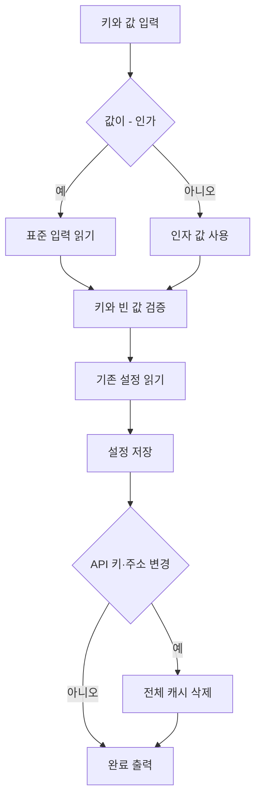
```mermaid
flowchart TD
    A["키와 값 입력"] --> B{"값이 - 인가"}
    B -->|예| C["표준 입력 읽기"]
    B -->|아니오| D["인자 값 사용"]
    C & D --> E["키와 빈 값 검증"]
    E --> F["기존 설정 읽기"]
    F --> G["설정 저장"]
    G --> H{"API 키·주소 변경"}
    H -->|예| I["전체 캐시 삭제"]
    H -->|아니오| J["완료 출력"]
    I --> J
```

- 지원하지 않는 키나 공백을 제거한 뒤 빈 값이면 종료 코드 3으로 끝난다.
- 기존 설정 파일이 손상됐거나 읽히지 않으면 덮어쓰지 않고 끝난다.
- API 키나 API 주소가 실제로 바뀔 때만 캐시를 지운다. 캐시 삭제가 실패해도 경고만 내고 설정 변경은 성공으로 끝낸다.

## Claude Code 스킬 관리 흐름

### `skill status`

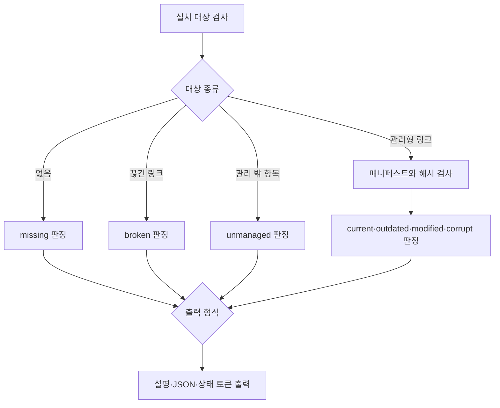
```mermaid
flowchart TD
    A["설치 대상 검사"] --> B{"대상 종류"}
    B -->|없음| C["missing 판정"]
    B -->|끊긴 링크| D["broken 판정"]
    B -->|관리 밖 항목| E["unmanaged 판정"]
    B -->|관리형 링크| F["매니페스트와 해시 검사"]
    F --> G["current·outdated·modified·corrupt 판정"]
    C & D & E & G --> H{"출력 형식"}
    H --> I["설명·JSON·상태 토큰 출력"]
```

- 상태 조회 자체가 끝나면 설치 상태와 관계없이 종료 코드 0을 반환한다.
- 관리형 콘텐츠의 실제 해시가 매니페스트와 다르면 `modified`, 매니페스트가 없거나 형식·경로가 맞지 않으면 `corrupt`다.
- 절대 경로인 `XDG_DATA_HOME`이 있으면 그 아래 `dooray-cli`, 아니면 `~/.local/share/dooray-cli`를 관리 저장소로 쓴다.

### `skill install`과 `skill update`

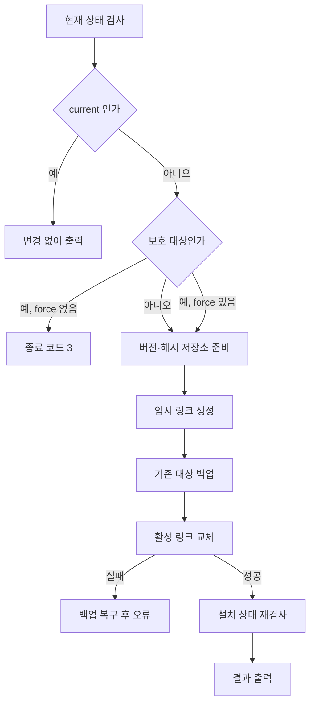
```mermaid
flowchart TD
    A["현재 상태 검사"] --> B{"current 인가"}
    B -->|예| C["변경 없이 출력"]
    B -->|아니오| D{"보호 대상인가"}
    D -->|예, force 없음| E["종료 코드 3"]
    D -->|아니오| F["버전·해시 저장소 준비"]
    D -->|예, force 있음| F
    F --> G["임시 링크 생성"]
    G --> H["기존 대상 백업"]
    H --> I["활성 링크 교체"]
    I -->|실패| J["백업 복구 후 오류"]
    I -->|성공| K["설치 상태 재검사"]
    K --> L["결과 출력"]
```

- `unmanaged`, `modified`, `corrupt`는 `--force`가 없으면 보존하고 종료 코드 3으로 끝난다.
- 같은 버전·해시 저장소가 수정됐거나 손상됐으면 `--force`에서 먼저 별도 백업으로 격리한다.
- 링크 전환이나 사후 검증이 실패하면 가능한 범위에서 기존 링크와 격리한 저장소를 복구한다.

## 일반 조회 흐름

### `project list`

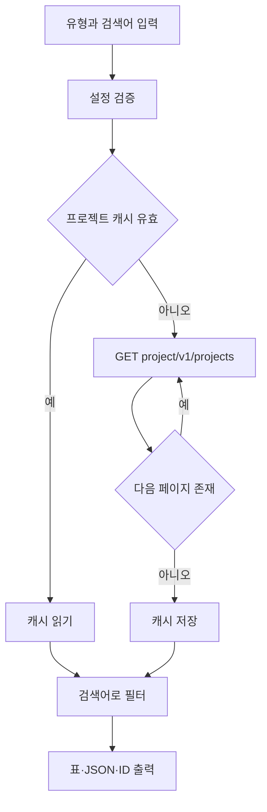
```mermaid
flowchart TD
    A["유형과 검색어 입력"] --> B["설정 검증"]
    B --> C{"프로젝트 캐시 유효"}
    C -->|예| D["캐시 읽기"]
    C -->|아니오| E["GET project/v1/projects"]
    E --> F{"다음 페이지 존재"}
    F -->|예| E
    F -->|아니오| G["캐시 저장"]
    D & G --> H["검색어로 필터"]
    H --> I["표·JSON·ID 출력"]
```

- 프로젝트 캐시 TTL은 1시간이고 API 페이지 크기는 100이다.
- `private` 유형은 API에 `type=private`을 보내며, 검색어는 프로젝트 코드에서 대소문자를 구분하지 않고 찾는다.

### `post list`와 `post search`

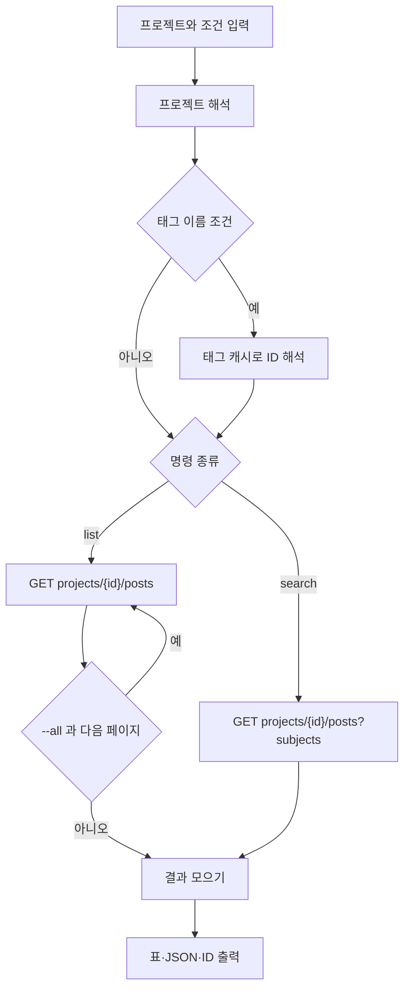
```mermaid
flowchart TD
    A["프로젝트와 조건 입력"] --> B["프로젝트 해석"]
    B --> C{"태그 이름 조건"}
    C -->|예| D["태그 캐시로 ID 해석"]
    C -->|아니오| E{"명령 종류"}
    D --> E
    E -->|list| F["GET projects/{id}/posts"]
    E -->|search| G["GET projects/{id}/posts?subjects"]
    F --> H{"--all 과 다음 페이지"}
    H -->|예| F
    H -->|아니오| I["결과 모으기"]
    G --> I
    I --> J["표·JSON·ID 출력"]
```

- 프로젝트 해석이 실패하거나 이름이 여러 프로젝트와 맞으면 후보를 보여 주고 종료 코드 3으로 끝난다. 15자리 이상 숫자는 프로젝트 ID로 바로 쓴다.
- `list`의 기본 페이지는 0, 크기는 20이다. `--all`은 크기 100으로 전체 페이지를 읽는다.
- 두 명령 모두 생성 시각 내림차순으로 요청한다. 태그 캐시 TTL은 24시간이고 페이지 크기는 100이다.

### `post get`

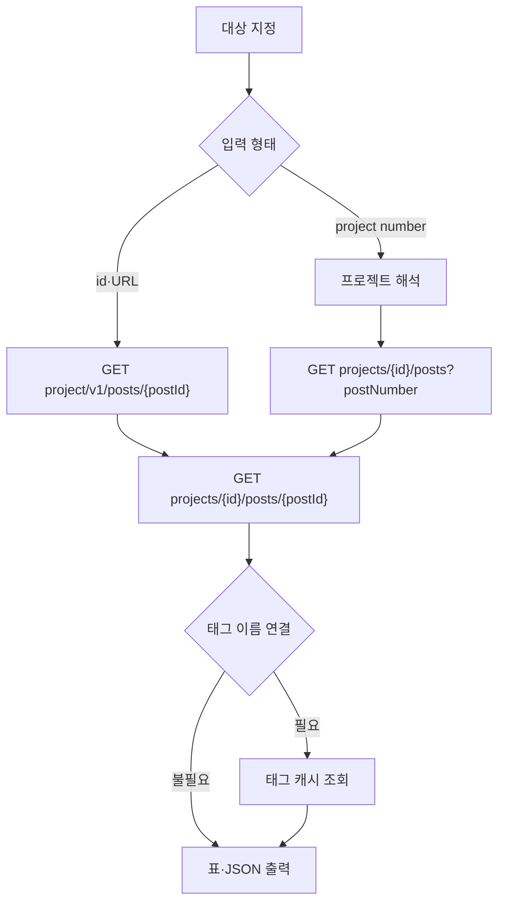
```mermaid
flowchart TD
    A["대상 지정"] --> B{"입력 형태"}
    B -->|id·URL| C["GET project/v1/posts/{postId}"]
    B -->|project number| D["프로젝트 해석"]
    D --> E["GET projects/{id}/posts?postNumber"]
    C & E --> F["GET projects/{id}/posts/{postId}"]
    F --> G{"태그 이름 연결"}
    G -->|필요| H["태그 캐시 조회"]
    G -->|불필요| I["표·JSON 출력"]
    H --> I
```

- `--id`, `--url`, 위치 인자를 함께 쓰거나 필요한 값이 없으면 종료 코드 3으로 끝난다.
- 일반 출력은 태그 이름 연결에 실패해도 경고 후 ID를 남긴다. `--json --with-tag-names`는 연결 실패를 오류로 처리한다.
- `--with-tag-names`를 `--json` 없이 주면 효력이 없다는 경고를 내며, 일반 출력은 원래 태그 이름을 연결한다.

## 업무 생성 흐름

### `post create`

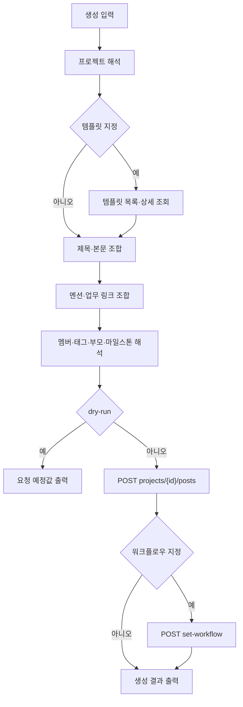
```mermaid
flowchart TD
    A["생성 입력"] --> B["프로젝트 해석"]
    B --> C{"템플릿 지정"}
    C -->|예| D["템플릿 목록·상세 조회"]
    C -->|아니오| E["제목·본문 조합"]
    D --> E
    E --> F["멘션·업무 링크 조합"]
    F --> G["멤버·태그·부모·마일스톤 해석"]
    G --> H{"dry-run"}
    H -->|예| I["요청 예정값 출력"]
    H -->|아니오| J["POST projects/{id}/posts"]
    J --> K{"워크플로우 지정"}
    K -->|예| L["POST set-workflow"]
    K -->|아니오| M["생성 결과 출력"]
    L --> M
```

- 제목이 사용자 입력과 템플릿 모두에 없으면 종료 코드 3으로 끝난다. 사용자 입력은 템플릿의 제목·본문·담당자·참조자·태그를 해당 항목별로 덮는다.
- 그룹 멘션은 공개 프로젝트 코드가 있어야 만들 수 있다. 멤버·그룹·태그·부모·마일스톤이 없거나 모호하면 후보와 함께 종료 코드 3으로 끝난다.
- 템플릿·태그·마일스톤·멤버 그룹 캐시 TTL은 24시간이다. 템플릿 상세는 `interpolation=true`로 조회한다.
- 생성 뒤 워크플로우 변경이 실패하면 생성된 업무는 남고, 경고와 업무 ID를 출력한 뒤 성공으로 끝난다.

## 업무 수정 흐름 ($EDITOR)

### 대화형 `post edit`

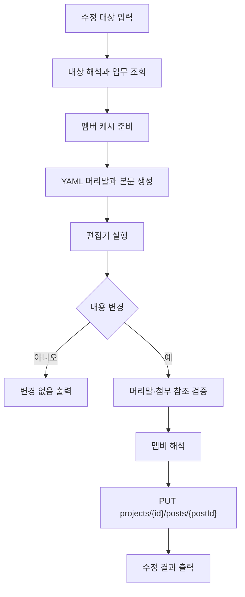
```mermaid
flowchart TD
    A["수정 대상 입력"] --> B["대상 해석과 업무 조회"]
    B --> C["멤버 캐시 준비"]
    C --> D["YAML 머리말과 본문 생성"]
    D --> E["편집기 실행"]
    E --> F{"내용 변경"}
    F -->|아니오| G["변경 없음 출력"]
    F -->|예| H["머리말·첨부 참조 검증"]
    H --> I["멤버 해석"]
    I --> J["PUT projects/{id}/posts/{postId}"]
    J --> K["수정 결과 출력"]
```

- `$EDITOR`가 없으면 API 수정 전에 오류로 끝난다.
- 본문에서 기존 첨부 참조가 사라지면 경고하고 확인한다. 비대화형 환경에서는 `--no-confirm`이 없으면 종료 코드 3으로 끝난다.
- 대화형 경로에서는 멘션, 업무 링크, 상위 업무 옵션을 적용하지 않고 경고한다.

### 비대화형 `post edit`

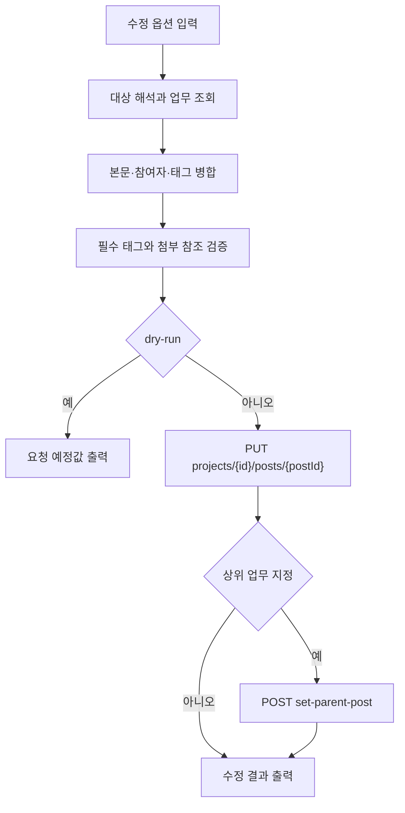
```mermaid
flowchart TD
    A["수정 옵션 입력"] --> B["대상 해석과 업무 조회"]
    B --> C["본문·참여자·태그 병합"]
    C --> D["필수 태그와 첨부 참조 검증"]
    D --> E{"dry-run"}
    E -->|예| F["요청 예정값 출력"]
    E -->|아니오| G["PUT projects/{id}/posts/{postId}"]
    G --> H{"상위 업무 지정"}
    H -->|예| I["POST set-parent-post"]
    H -->|아니오| J["수정 결과 출력"]
    I --> J
```

- 제목, 본문, 본문 파일, 태그, 담당자·참조자 변경, MIME 형식 중 하나가 있어야 비대화형 경로로 들어간다. 멘션·업무 링크만 있어도 들어가지만 `--parent`만 단독으로 주면 대화형 경로로 들어가 적용되지 않는다.
- HTML 업무에서 마크다운 멘션이나 업무 링크를 넣으면 API 호출 전에 종료 코드 3으로 끝난다.
- MIME 형식만 바꾸면 본문을 변환하지 않는다는 경고를 내고 기존 본문을 그대로 보낸다.
- 업무 수정 후 상위 업무 설정이 실패하면 앞선 수정은 남으며, 부분 성공 경고를 내고 오류로 끝난다.

## 캐시 흐름

### 조회 명령의 캐시 사용

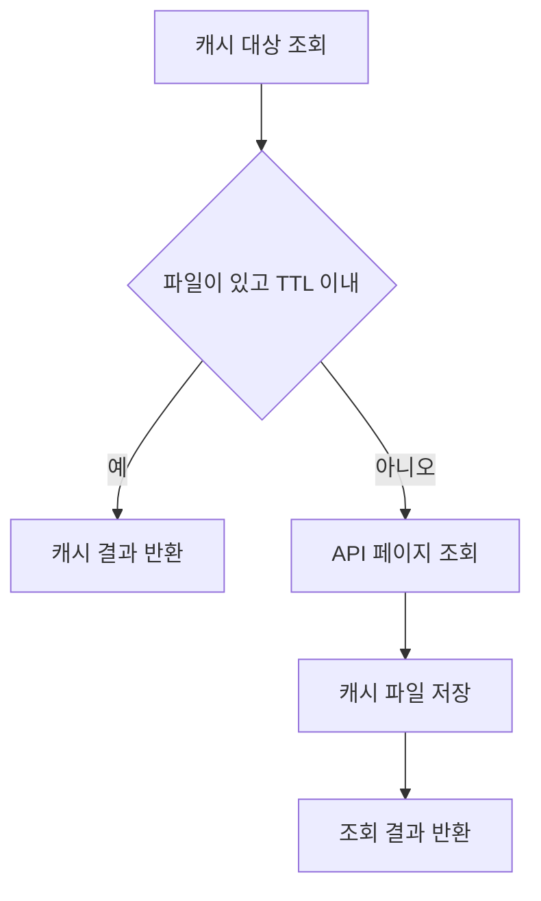
```mermaid
flowchart TD
    A["캐시 대상 조회"] --> B{"파일이 있고 TTL 이내"}
    B -->|예| C["캐시 결과 반환"]
    B -->|아니오| D["API 페이지 조회"]
    D --> E["캐시 파일 저장"]
    E --> F["조회 결과 반환"]
```

- 프로젝트와 멤버 캐시 TTL은 1시간이다. 내 정보, 워크플로우, 태그, 마일스톤, 멤버 그룹, 위키, 템플릿 캐시 TTL은 24시간이다.
- 설정의 API 키나 API 주소가 바뀌거나, 읽지 못한 기존 설정을 `setup`으로 교체하면 전체 캐시를 지운다. 태그 생성·그룹 변경 뒤에는 해당 프로젝트 태그 캐시만 지운다.

### `cache clear`와 `cache refresh`

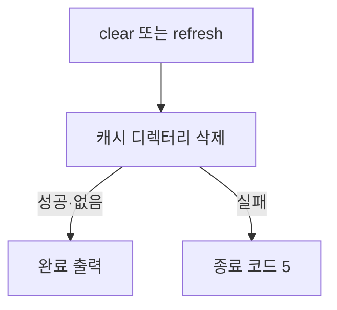
```mermaid
flowchart TD
    A["clear 또는 refresh"] --> B["캐시 디렉터리 삭제"]
    B -->|성공·없음| C["완료 출력"]
    B -->|실패| D["종료 코드 5"]
```

- 두 명령 모두 API를 호출하지 않고 캐시 파일만 지운다. `refresh`는 다음 조회 때 API에서 다시 채우게 하는 이름이다.
- 명시적인 캐시 삭제가 실패하면 경고로 넘기지 않고 종료 코드 5로 끝난다.

## 멤버 조회 흐름 (ADR-021)

### `member list`와 `project members`

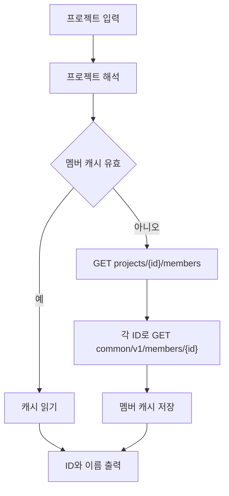
```mermaid
flowchart TD
    A["프로젝트 입력"] --> B["프로젝트 해석"]
    B --> C{"멤버 캐시 유효"}
    C -->|예| D["캐시 읽기"]
    C -->|아니오| E["GET projects/{id}/members"]
    E --> F["각 ID로 GET common/v1/members/{id}"]
    F --> G["멤버 캐시 저장"]
    D & G --> H["ID와 이름 출력"]
```

- 멤버 캐시 TTL은 1시간이고 프로젝트 멤버 API 페이지 크기는 100이다.
- 개별 상세 조회가 실패한 멤버는 이름을 비운 채 목록에 남긴다. 이 목록은 이메일을 출력하지 않는다.

### `member get`과 `member search`

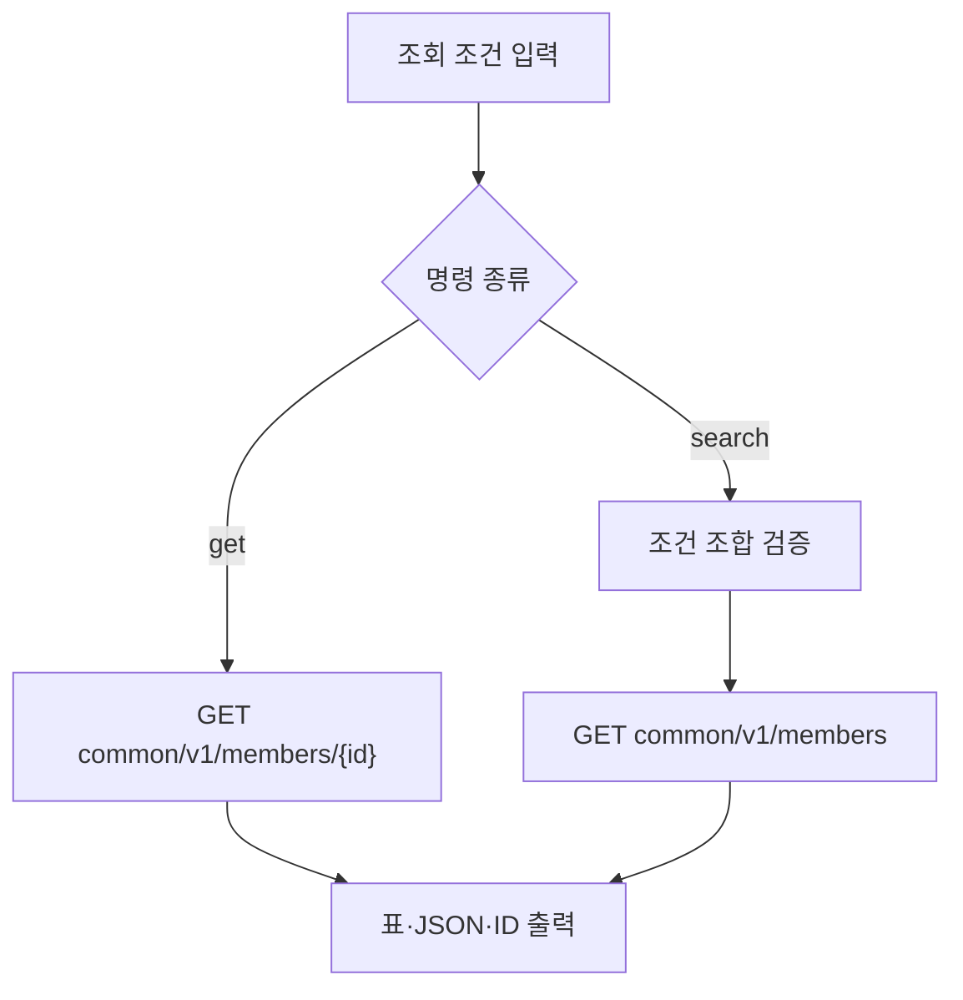
```mermaid
flowchart TD
    A["조회 조건 입력"] --> B{"명령 종류"}
    B -->|get| C["GET common/v1/members/{id}"]
    B -->|search| D["조건 조합 검증"]
    D --> E["GET common/v1/members"]
    C & E --> F["표·JSON·ID 출력"]
```

- 검색 조건이 하나도 없거나 위치 이름과 이메일·사용자 코드 조건을 함께 주면 종료 코드 3으로 끝난다.
- 검색 페이지는 0 이상으로, 크기는 1에서 100 사이로 맞춘 뒤 API에 보낸다.

### `project groups`

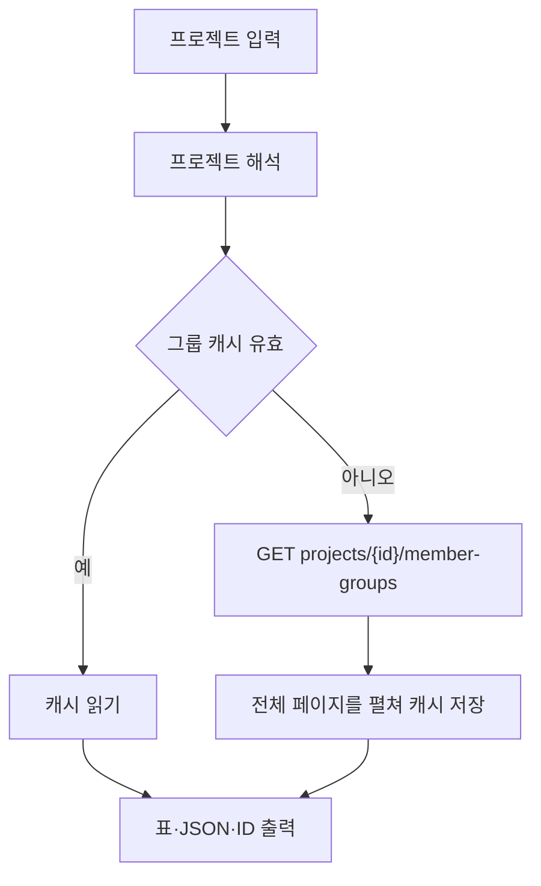
```mermaid
flowchart TD
    A["프로젝트 입력"] --> B["프로젝트 해석"]
    B --> C{"그룹 캐시 유효"}
    C -->|예| D["캐시 읽기"]
    C -->|아니오| E["GET projects/{id}/member-groups"]
    E --> F["전체 페이지를 펼쳐 캐시 저장"]
    D & F --> G["표·JSON·ID 출력"]
```

- 멤버 그룹 캐시 TTL은 24시간이고 API 페이지 크기는 100이다.

## 댓글 흐름

### `post comment list`, `latest`, `get`

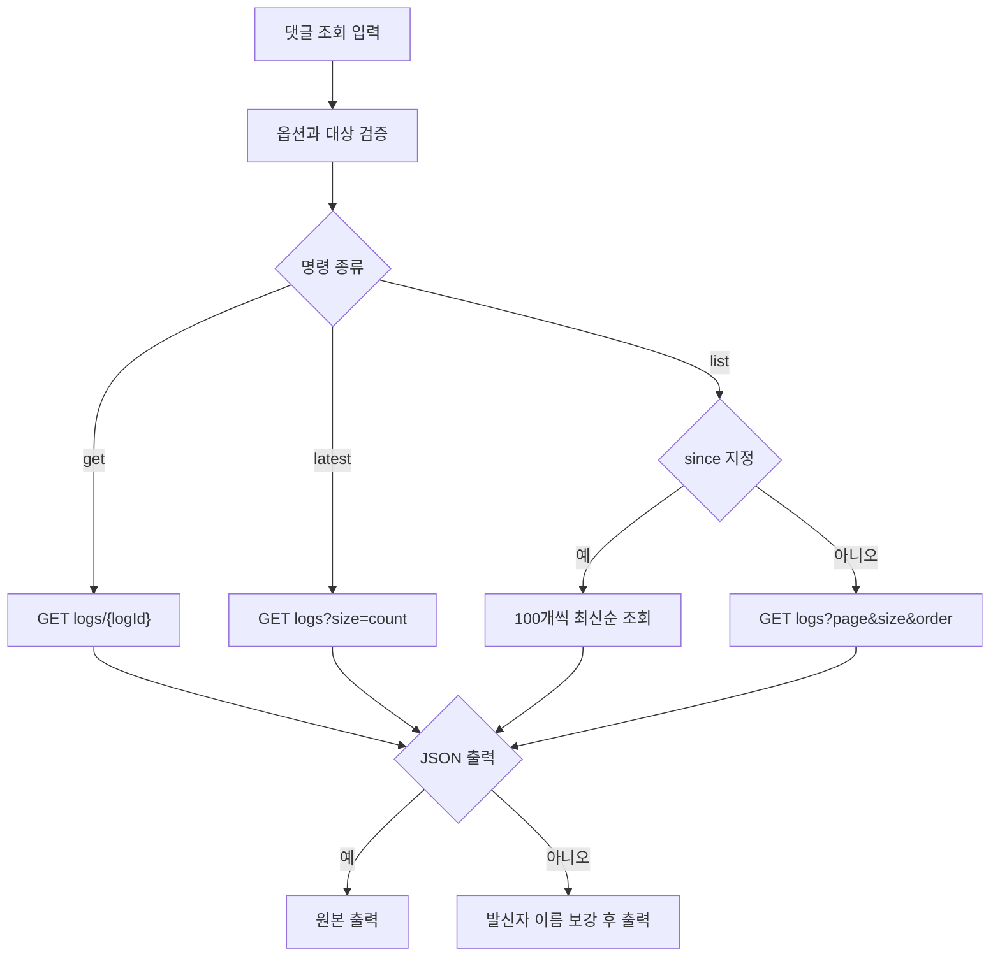
```mermaid
flowchart TD
    A["댓글 조회 입력"] --> B["옵션과 대상 검증"]
    B --> C{"명령 종류"}
    C -->|get| D["GET logs/{logId}"]
    C -->|latest| E["GET logs?size=count"]
    C -->|list| F{"since 지정"}
    F -->|예| G["100개씩 최신순 조회"]
    F -->|아니오| H["GET logs?page&size&order"]
    D & E & G & H --> I{"JSON 출력"}
    I -->|예| J["원본 출력"]
    I -->|아니오| K["발신자 이름 보강 후 출력"]
```

- `latest` 개수는 1에서 100 사이다. `latest`와 페이지·크기·정렬·기간 조건을 함께 쓰면 종료 코드 3으로 끝난다.
- `since`는 100개씩 최신순으로 읽다가 기준보다 오래된 댓글을 만나면 멈춘다. 오름차순 출력은 모은 뒤 뒤집는다.
- 이름 보강이 실패하면 경고하고 멤버 ID를 남긴다. JSON은 파이프라인 호환을 위해 원본을 유지한다.

### `post comment add`

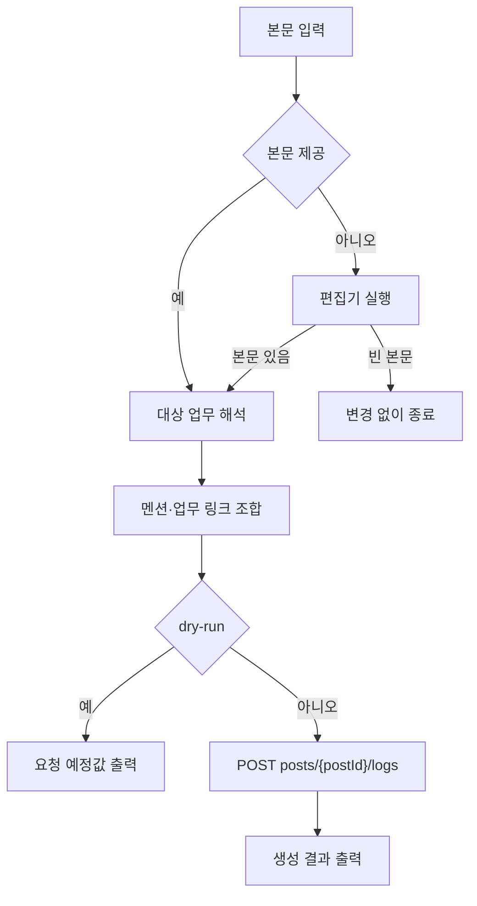
```mermaid
flowchart TD
    A["본문 입력"] --> B{"본문 제공"}
    B -->|아니오| C["편집기 실행"]
    B -->|예| D["대상 업무 해석"]
    C -->|빈 본문| E["변경 없이 종료"]
    C -->|본문 있음| D
    D --> F["멘션·업무 링크 조합"]
    F --> G{"dry-run"}
    G -->|예| H["요청 예정값 출력"]
    G -->|아니오| I["POST posts/{postId}/logs"]
    I --> J["생성 결과 출력"]
```

- HTML 댓글에 마크다운 멘션이나 업무 링크를 넣으면 종료 코드 3으로 끝난다.

### `post comment edit`

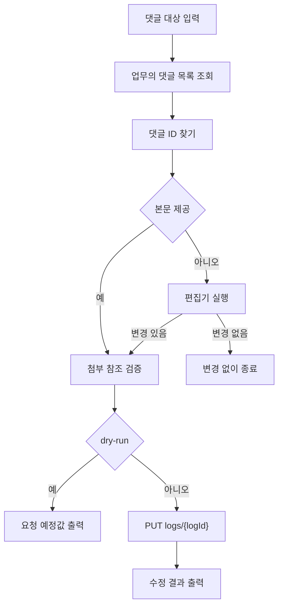
```mermaid
flowchart TD
    A["댓글 대상 입력"] --> B["업무의 댓글 목록 조회"]
    B --> C["댓글 ID 찾기"]
    C --> D{"본문 제공"}
    D -->|아니오| E["편집기 실행"]
    D -->|예| F["첨부 참조 검증"]
    E -->|변경 없음| G["변경 없이 종료"]
    E -->|변경 있음| F
    F --> H{"dry-run"}
    H -->|예| I["요청 예정값 출력"]
    H -->|아니오| J["PUT logs/{logId}"]
    J --> K["수정 결과 출력"]
```

- 댓글 ID를 찾지 못하면 오류 메시지를 쓰고 종료 코드 1로 끝난다.
- MIME 형식만 바꾸면 기존 본문을 다시 보낸다. HTML과 마크다운 합성 옵션을 함께 쓰면 종료 코드 3으로 끝난다.
- 기존 첨부 참조가 사라지면 업무 수정과 같은 확인 정책을 적용한다.

### `post comment delete`

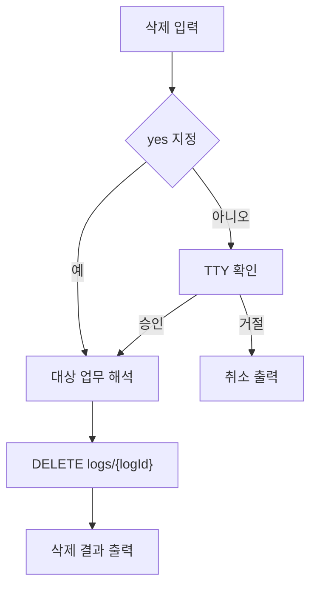
```mermaid
flowchart TD
    A["삭제 입력"] --> B{"yes 지정"}
    B -->|아니오| C["TTY 확인"]
    B -->|예| D["대상 업무 해석"]
    C -->|거절| E["취소 출력"]
    C -->|승인| D
    D --> F["DELETE logs/{logId}"]
    F --> G["삭제 결과 출력"]
```

- `--yes`가 없는 비대화형 환경에서는 설정이나 API를 읽기 전에 종료 코드 3으로 끝난다.
- 확인의 기본값은 아니오이며, 거절은 API를 호출하지 않고 성공으로 끝난다.

## 댓글 첨부파일 흐름 (ADR-024)

### `post comment file list`

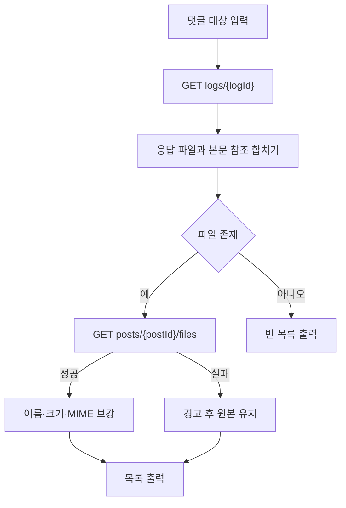
```mermaid
flowchart TD
    A["댓글 대상 입력"] --> B["GET logs/{logId}"]
    B --> C["응답 파일과 본문 참조 합치기"]
    C --> D{"파일 존재"}
    D -->|예| E["GET posts/{postId}/files"]
    D -->|아니오| F["빈 목록 출력"]
    E -->|성공| G["이름·크기·MIME 보강"]
    E -->|실패| H["경고 후 원본 유지"]
    G & H --> I["목록 출력"]
```

- 댓글 응답의 파일과 본문 `/files/{id}` 참조를 ID 기준으로 합친다. 메타데이터 보강 실패는 목록 조회를 실패시키지 않는다.

### `post comment file upload`

```mermaid
flowchart TD
    A["댓글과 파일 입력"] --> B["GET logs/{logId}"]
    B --> C{"댓글이 HTML"}
    C -->|예| D["종료 코드 3"]
    C -->|아니오| E["POST posts/{postId}/files"]
    E --> F["본문에 파일 참조 추가"]
    F --> G["PUT logs/{logId}"]
    G --> H["업로드 결과 출력"]
```

- 이미지 확장자는 이미지 마크다운으로, 나머지는 일반 링크로 본문에 추가한다.
- 파일 업로드 뒤 댓글 수정이 실패하면 참조되지 않은 파일이 업무에 남는다. 정리 방법을 경고하고 0이 아닌 종료 코드로 끝난다.

### `post comment file download`

```mermaid
flowchart TD
    A["댓글·파일 ID 입력"] --> B["업무 대상 해석"]
    B --> C["GET files/{fileId}?media=raw"]
    C --> D["리다이렉트 URL 다운로드"]
    D --> E["안전한 파일명으로 저장"]
    E --> F["저장 경로 출력"]
```

- 댓글 ID는 입력 형태를 통일하기 위해 받지만 다운로드 API 경로에는 쓰지 않는다.

### `post comment file delete`

```mermaid
flowchart TD
    A["삭제 입력"] --> B["공통 삭제 확인"]
    B --> C["GET logs/{logId}"]
    C --> D{"본문 참조 존재"}
    D -->|아니오| E["종료 코드 3"]
    D -->|예| F["참조를 뺀 본문 PUT"]
    F --> G["DELETE posts/{postId}/files/{fileId}"]
    G --> H["삭제 결과 출력"]
```

- HTML 댓글에서도 과거 CLI가 남긴 마크다운 참조를 찾아 제거한다.
- 본문 수정과 파일 삭제는 원자적이지 않다. 어느 단계에서 실패했는지와 남은 정리 작업을 경고하고 오류로 끝난다.

## 참조자(cc) / 담당자(to) 변경 흐름 (ADR-025)

### `post create`의 참여자 처리

```mermaid
flowchart TD
    A["멤버·그룹 입력"] --> B["프로젝트 멤버·그룹 캐시 조회"]
    B --> C["이름·이메일·ID 해석"]
    C --> D["그룹 멤버 펼치기"]
    D --> E["중복 제거"]
    E --> F["POST 요청의 to·cc 구성"]
```

- 15자리 이상 숫자는 조직 멤버 ID로 바로 쓰고, 이메일은 정확히 일치해야 한다. 이름·그룹 코드의 일치 결과가 여러 개면 후보와 함께 종료 코드 3으로 끝난다.

### `post edit`의 참여자 처리

```mermaid
flowchart TD
    A["기존 업무 조회"] --> B["기존 to·cc 읽기"]
    B --> C{"clear 지정"}
    C -->|예| D["기존 목록 비우기"]
    C -->|아니오| E["기존 목록 유지"]
    D & E --> F["입력 멤버·그룹 해석"]
    F --> G["추가·제거와 중복 제거"]
    G --> H["PUT 요청의 to·cc 구성"]
```

- 참여자 변경 옵션 하나만 있어도 비대화형 수정 경로로 들어간다.
- 태그 변경 옵션이 없으면 `tagIds`를 보내지 않아 기존 태그를 보존한다.

## 템플릿으로 정형 업무 생성 흐름 (ADR-027)

### `project templates`

```mermaid
flowchart TD
    A["프로젝트 입력"] --> B["프로젝트 해석"]
    B --> C{"템플릿 캐시 유효"}
    C -->|예| D["캐시 읽기"]
    C -->|아니오| E["GET projects/{id}/templates"]
    E --> F["전체 페이지를 캐시 저장"]
    D & F --> G["목록 출력"]
```

- 템플릿 캐시 TTL은 24시간이고 API 페이지 크기는 100이다.

### 템플릿을 지정한 `post create`

```mermaid
flowchart TD
    A["템플릿 이름 입력"] --> B["템플릿 캐시에서 해석"]
    B --> C["GET templates/{templateId}?interpolation=true"]
    C --> D["템플릿 필드 읽기"]
    D --> E["사용자 입력으로 항목별 덮어쓰기"]
    E --> F["일반 post create 흐름"]
```

- 템플릿 이름이 없거나 여러 개와 맞으면 후보와 함께 종료 코드 3으로 끝난다.
- 사용자 제목·본문·담당자·참조자·태그가 있으면 해당 템플릿 값을 대신한다.

## 상위 업무 변경 흐름 (Issue #60)

### `post edit --parent`

```mermaid
flowchart TD
    A["상위 업무 입력"] --> B{"다른 비대화형 옵션"}
    B -->|없음| C["대화형 경로에서 경고 후 무시"]
    B -->|있음| D["대상과 상위 업무 해석"]
    D --> E["PUT posts/{postId}"]
    E --> F["POST set-parent-post"]
    F --> G["수정 결과 출력"]
```

- 상위 업무는 `project/number` 또는 업무 ID로 해석한다. 없거나 모호하면 종료 코드 3으로 끝난다.
- 업무 본문 수정과 상위 업무 설정은 서로 다른 요청이다. 두 번째 요청이 실패하면 첫 번째 수정은 남고 오류로 끝난다.
- 상위 업무 해제 API는 없어 이 명령으로 최상위 업무로 바꿀 수 없다.

## 업무 메타데이터 흐름 (ADR-019)

### 메타데이터를 지정한 `post create`

```mermaid
flowchart TD
    A["태그·부모·워크플로우·마일스톤 입력"] --> B["프로젝트 해석"]
    B --> C["태그·부모·마일스톤 병렬 해석"]
    C --> D["필수·단일 선택 태그 검증"]
    D --> E["POST projects/{id}/posts"]
    E --> F{"워크플로우 지정"}
    F -->|예| G["POST set-workflow"]
    F -->|아니오| H["결과 출력"]
    G --> H
```

- 태그, 마일스톤, 워크플로우 캐시 TTL은 24시간이다. 이름이 없거나 모호하면 후보와 함께 종료 코드 3으로 끝난다.
- 필수 태그 그룹이 비었거나 단일 선택 그룹에 여러 태그가 있으면 생성 API를 호출하지 않는다.

### 태그를 바꾸는 `post edit`

```mermaid
flowchart TD
    A["기존 업무 조회"] --> B["기존 태그 읽기"]
    B --> C{"tag-clear"}
    C -->|예| D["기존 태그 비우기"]
    C -->|아니오| E["기존 태그 유지"]
    D & E --> F["tag-remove 제거"]
    F --> G["tag 추가와 중복 제거"]
    G --> H["필수·단일 선택 검증"]
    H --> I["PUT posts/{postId}"]
```

- 태그 변경 옵션만으로 비대화형 수정 경로에 들어가며, 기존 제목과 본문을 함께 다시 보낸다.

## 프로젝트 태그 관리 흐름 (ADR-041)

### `project tags`와 `project tags list`

```mermaid
flowchart TD
    A["프로젝트 입력"] --> B["프로젝트 해석"]
    B --> C{"태그 캐시 유효"}
    C -->|예| D["캐시 읽기"]
    C -->|아니오| E["GET projects/{id}/tags"]
    E --> F["전체 페이지를 캐시 저장"]
    D & F --> G["태그 목록 출력"]
```

- 두 명령은 같은 목록 흐름을 사용한다. 태그 캐시 TTL은 24시간이고 API 페이지 크기는 100이다.

### `project tags create`

```mermaid
flowchart TD
    A["이름과 색 입력"] --> B["프로젝트 해석"]
    B --> C["이름과 6자리 색 검증"]
    C --> D["POST projects/{id}/tags"]
    D --> E["프로젝트 태그 캐시 삭제"]
    E --> F["생성 결과 출력"]
```

- 색을 생략하면 `e0e0e0`을 쓰고 앞의 `#`은 제거한다. 6자리 16진수가 아니면 종료 코드 3으로 끝난다.
- 생성 뒤 캐시 삭제가 실패해도 경고만 내고 생성은 성공으로 끝난다.

### `project tags group`

```mermaid
flowchart TD
    A["그룹 이름과 변경값 입력"] --> B["변경값 존재 검증"]
    B --> C["프로젝트와 태그 캐시 조회"]
    C --> D["그룹 해석"]
    D --> E["지정하지 않은 현재 값 유지"]
    E --> F["PUT tag-groups/{groupId}"]
    F --> G["프로젝트 태그 캐시 삭제"]
    G --> H["변경 결과 출력"]
```

- 필수 여부와 단일 선택 여부를 하나도 지정하지 않으면 종료 코드 3으로 끝난다.
- 태그가 하나도 없는 그룹은 태그 목록에서 찾을 수 없다. 캐시 삭제 실패는 경고만 남긴다.

## 업무 워크플로우 변경 흐름

### `post done`

```mermaid
flowchart TD
    A["업무 대상 입력"] --> B["업무 해석"]
    B --> C["POST posts/{postId}/set-done"]
    C --> D["완료 결과 출력"]
```

- 입력 형태가 충돌하거나 업무를 찾지 못하면 API 호출 전에 종료 코드 3으로 끝난다.

### `post workflow`

```mermaid
flowchart TD
    A["업무와 워크플로우 입력"] --> B["입력 형태 정규화"]
    B --> C["업무 해석"]
    C --> D["워크플로우 캐시 조회"]
    D --> E["class 또는 이름 해석"]
    E --> F["POST posts/{postId}/set-workflow"]
    F --> G["변경 결과 출력"]
```

- 워크플로우 값이 없거나 이름이 여러 개와 맞으면 후보와 함께 종료 코드 3으로 끝난다. class는 이름보다 먼저 정확히 일치시킨다.
- 워크플로우 캐시 TTL은 24시간이다.
