# dooray-cli 명령 동작 흐름

이 문서는 명령 입력이 검증, 분기, API 호출을 거쳐 출력으로 바뀌는 경로를 정리한다. 명령 문법과 옵션은 README.md, 에이전트의 명령 선택 기준은 skills/dooray-cli/SKILL.md, 결정 근거와 기각한 대안은 docs/adr/에서 다룬다.

## 최초 설정: `dooray setup`

### `setup`

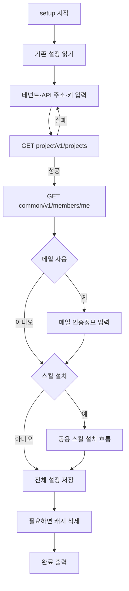

- API 연결이 실패하면 설정을 저장하지 않고 API 키 입력부터 다시 받는다.
- 입력 중 `Ctrl+C`가 들어오면 설정 파일을 쓰지 않고 끝난다.
- `~/.claude`가 없거나 `npx`로 실행한 경우에는 스킬 설치 질문을 건너뛴다. 스킬 설치가 실패해도 경고만 내고 설정은 저장한다.
- 기존 설정이 없으면 캐시를 지우지 않는다. 기존 설정을 읽을 수 없거나 API 키·API 주소가 바뀌면 저장 후 전체 캐시를 지우며, 삭제 실패는 경고로 남긴다.

### `config set`

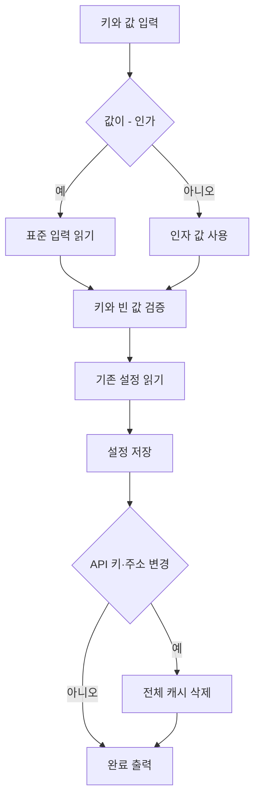

- 지원하지 않는 키나 공백을 제거한 뒤 빈 값이면 종료 코드 3으로 끝난다.
- 기존 설정 파일이 손상됐거나 읽히지 않으면 덮어쓰지 않고 끝난다.
- API 키나 API 주소가 실제로 바뀔 때만 캐시를 지운다. 캐시 삭제가 실패해도 경고만 내고 설정 변경은 성공으로 끝낸다.

## Claude Code 스킬 관리 흐름

### `skill status`

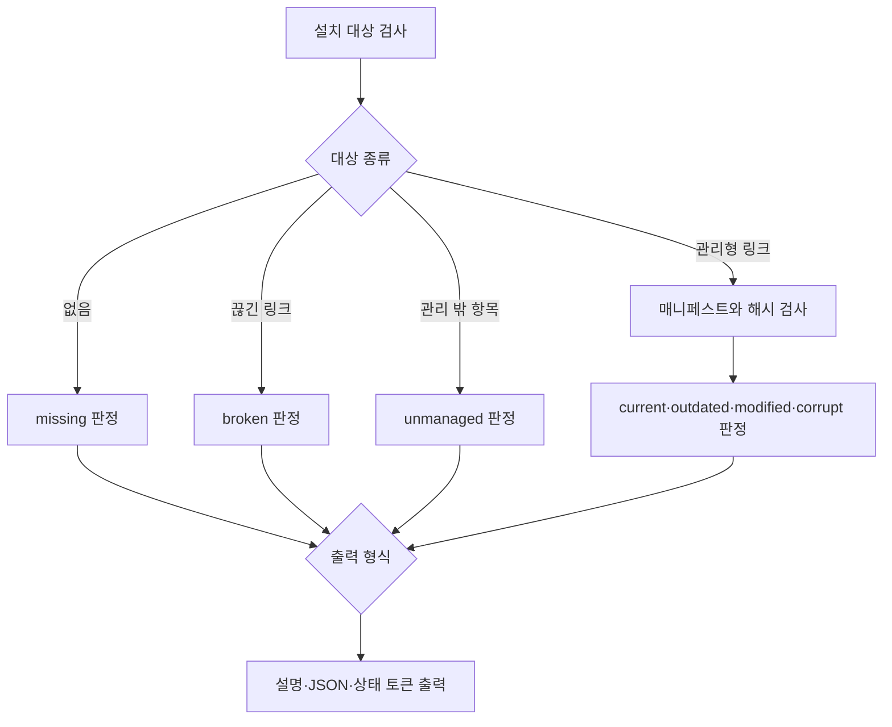

- 상태 조회 자체가 끝나면 설치 상태와 관계없이 종료 코드 0을 반환한다.
- 관리형 콘텐츠의 실제 해시가 매니페스트와 다르면 `modified`, 매니페스트가 없거나 형식·경로가 맞지 않으면 `corrupt`다.
- 절대 경로인 `XDG_DATA_HOME`이 있으면 그 아래 `dooray-cli`, 아니면 `~/.local/share/dooray-cli`를 관리 저장소로 쓴다.

### `skill install`과 `skill update`

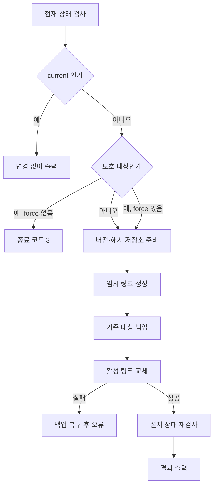

- `unmanaged`, `modified`, `corrupt`는 `--force`가 없으면 보존하고 종료 코드 3으로 끝난다.
- 같은 버전·해시 저장소가 수정됐거나 손상됐으면 `--force`에서 먼저 별도 백업으로 격리한다.
- 링크 전환이나 사후 검증이 실패하면 가능한 범위에서 기존 링크와 격리한 저장소를 복구한다.

## 일반 조회 흐름

### `project list`

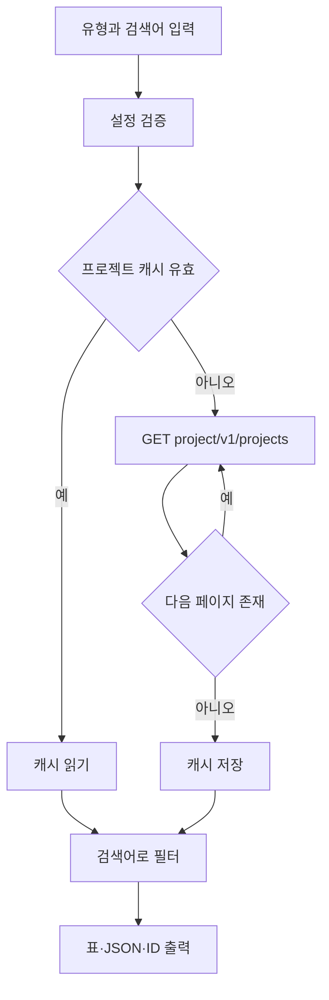

- 프로젝트 캐시 TTL은 1시간이고 API 페이지 크기는 100이다.
- `private` 유형은 API에 `type=private`을 보내며, 검색어는 프로젝트 코드에서 대소문자를 구분하지 않고 찾는다.

### `post list`와 `post search`

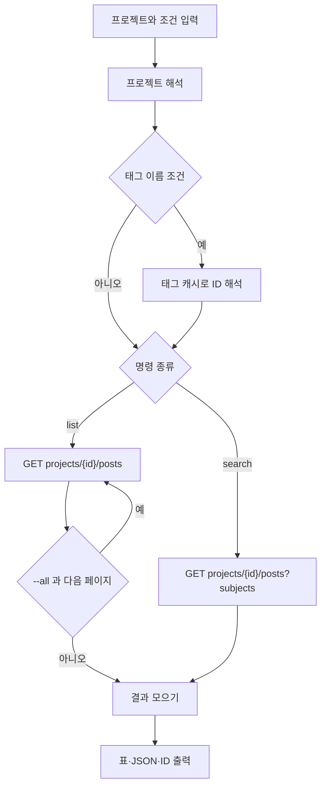

- 프로젝트 해석이 실패하거나 이름이 여러 프로젝트와 맞으면 후보를 보여 주고 종료 코드 3으로 끝난다. 15자리 이상 숫자는 프로젝트 ID로 바로 쓴다.
- `list`의 기본 페이지는 0, 크기는 20이다. `--all`은 크기 100으로 전체 페이지를 읽는다.
- 두 명령 모두 생성 시각 내림차순으로 요청한다. 태그 캐시 TTL은 24시간이고 페이지 크기는 100이다.

### `post get`

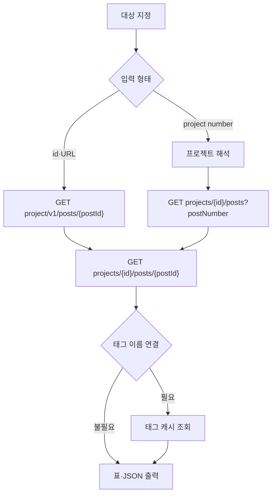

- `--id`, `--url`, 위치 인자를 함께 쓰거나 필요한 값이 없으면 종료 코드 3으로 끝난다.
- 일반 출력은 태그 이름 연결에 실패해도 경고 후 ID를 남긴다. `--json --with-tag-names`는 연결 실패를 오류로 처리한다.
- `--with-tag-names`를 `--json` 없이 주면 효력이 없다는 경고를 내며, 일반 출력은 원래 태그 이름을 연결한다.

## 업무 생성 흐름

### `post create`

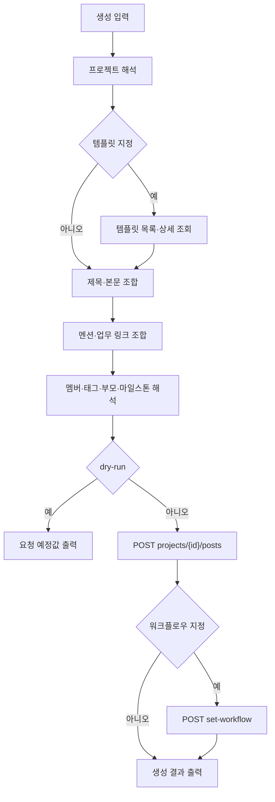

- 제목이 사용자 입력과 템플릿 모두에 없으면 종료 코드 3으로 끝난다. 사용자 입력은 템플릿의 제목·본문·담당자·참조자·태그보다 우선한다.
- 그룹 멘션은 공개 프로젝트 코드가 있어야 만들 수 있다. 멤버·그룹·태그·부모·마일스톤이 없거나 모호하면 후보와 함께 종료 코드 3으로 끝난다.
- 템플릿·태그·마일스톤·멤버 그룹 캐시 TTL은 24시간이다. 템플릿 상세는 `interpolation=true`로 조회한다.
- 생성 뒤 워크플로우 변경이 실패하면 생성된 업무는 남고, 경고와 업무 ID를 출력한 뒤 성공으로 끝난다.

## 업무 수정 흐름 ($EDITOR)

### 대화형 `post edit`

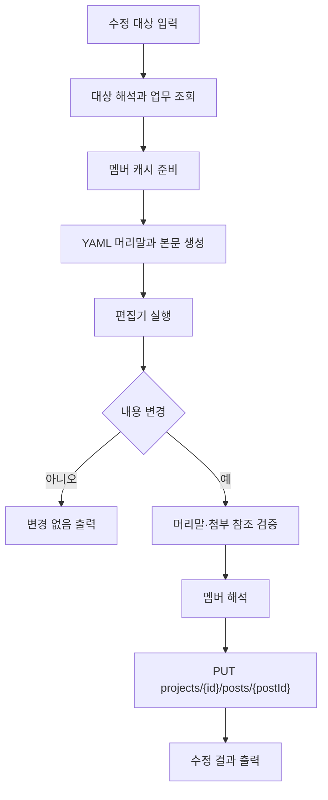

- `$EDITOR`가 없으면 API 수정 전에 오류로 끝난다.
- 본문에서 기존 첨부 참조가 사라지면 경고하고 확인한다. 비대화형 환경에서는 `--no-confirm`이 없으면 종료 코드 3으로 끝난다.
- 대화형 경로에서는 멘션, 업무 링크, 상위 업무 옵션을 적용하지 않고 경고한다.

### 비대화형 `post edit`

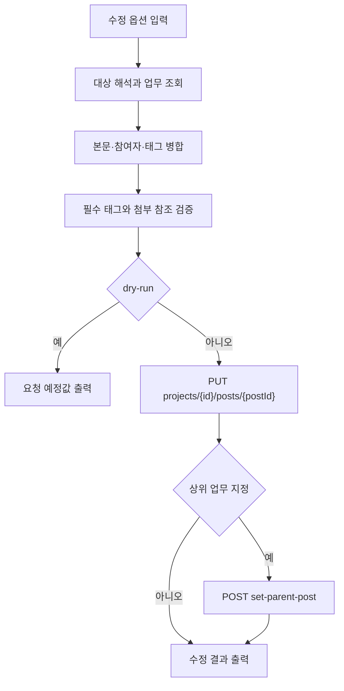

- 제목, 본문, 본문 파일, 태그, 담당자·참조자 변경, MIME 형식 중 하나가 있어야 비대화형 경로로 들어간다. 멘션, 그룹 멘션, 업무 링크, 상위 업무만 단독으로 지정하면 대화형 경로로 들어가며 해당 옵션을 적용하지 않고 경고한다.
- HTML 업무에서 마크다운 멘션이나 업무 링크를 넣으면 API 호출 전에 종료 코드 3으로 끝난다.
- MIME 형식만 바꾸면 본문을 변환하지 않는다는 경고를 내고 기존 본문을 그대로 보낸다.
- 업무 수정 후 상위 업무 설정이 실패하면 앞선 수정은 남으며, 부분 성공 경고를 내고 오류로 끝난다.

## 캐시 흐름

### 조회 명령의 캐시 사용

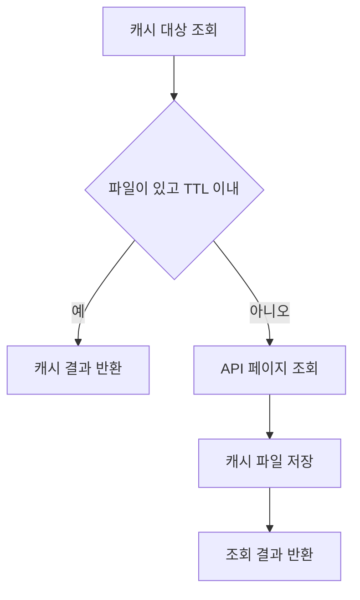

- 프로젝트와 멤버 캐시 TTL은 1시간이다. 내 정보, 워크플로우, 태그, 마일스톤, 멤버 그룹, 위키, 템플릿 캐시 TTL은 24시간이다.
- 설정의 API 키나 API 주소가 바뀌거나, 읽지 못한 기존 설정을 `setup`으로 교체하면 전체 캐시를 지운다. 태그 생성·그룹 변경 뒤에는 해당 프로젝트 태그 캐시만 지운다.

### `cache clear`와 `cache refresh`

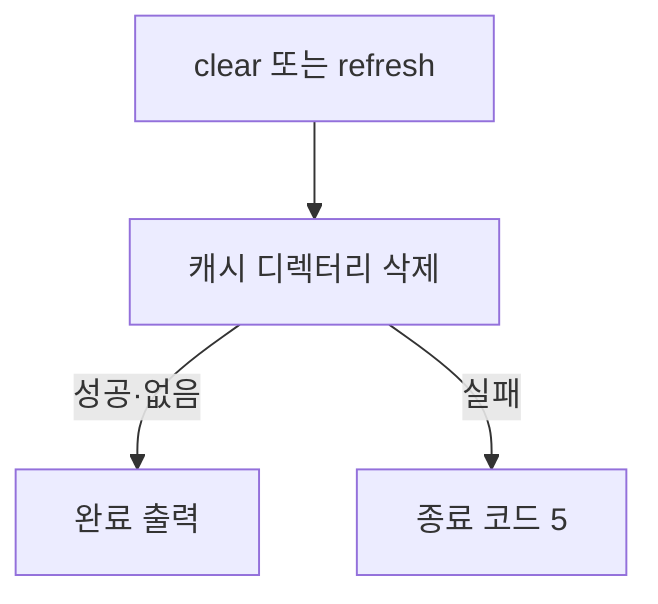

- 두 명령 모두 API를 호출하지 않고 캐시 파일만 지운다. `refresh`는 다음 조회 때 API에서 다시 채우게 하는 이름이다.
- 명시적인 캐시 삭제가 실패하면 경고로 넘기지 않고 종료 코드 5로 끝난다.

## 멤버 조회 흐름 (ADR-021)

### `member list`와 `project members`

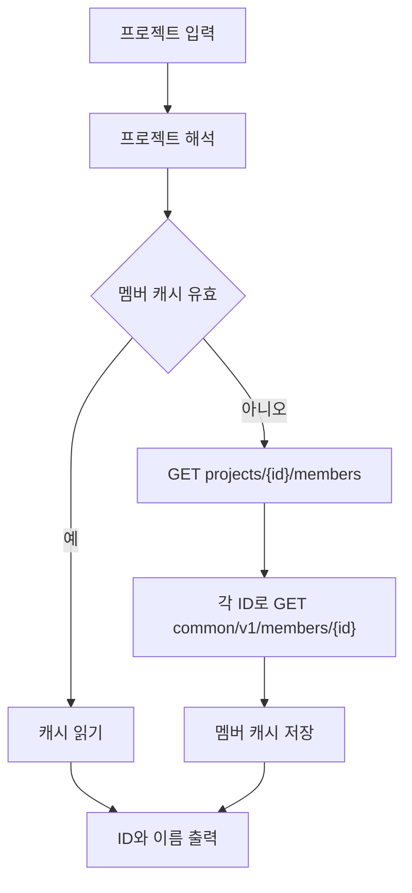

- 멤버 캐시 TTL은 1시간이고 프로젝트 멤버 API 페이지 크기는 100이다.
- 개별 상세 조회가 실패한 멤버는 이름을 비운 채 목록에 남긴다. 이 목록은 이메일을 출력하지 않는다.

### `member get`과 `member search`

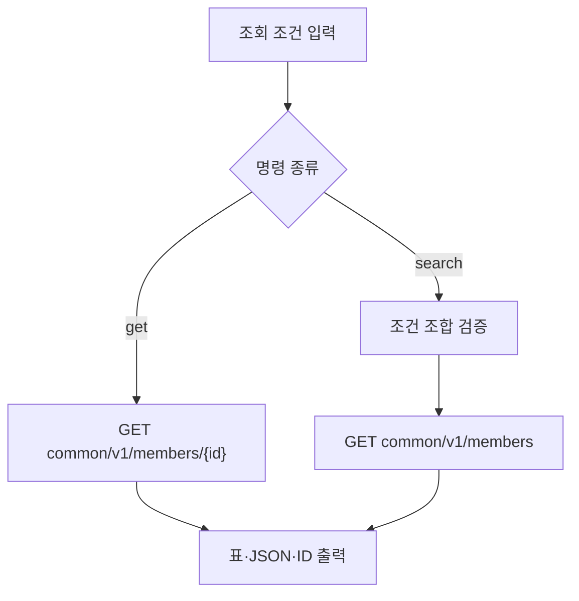

- 검색 조건이 하나도 없거나 위치 이름과 이메일·사용자 코드 조건을 함께 주면 종료 코드 3으로 끝난다.
- 검색 페이지는 0 이상으로, 크기는 1에서 100 사이로 맞춘 뒤 API에 보낸다.

### `project groups`

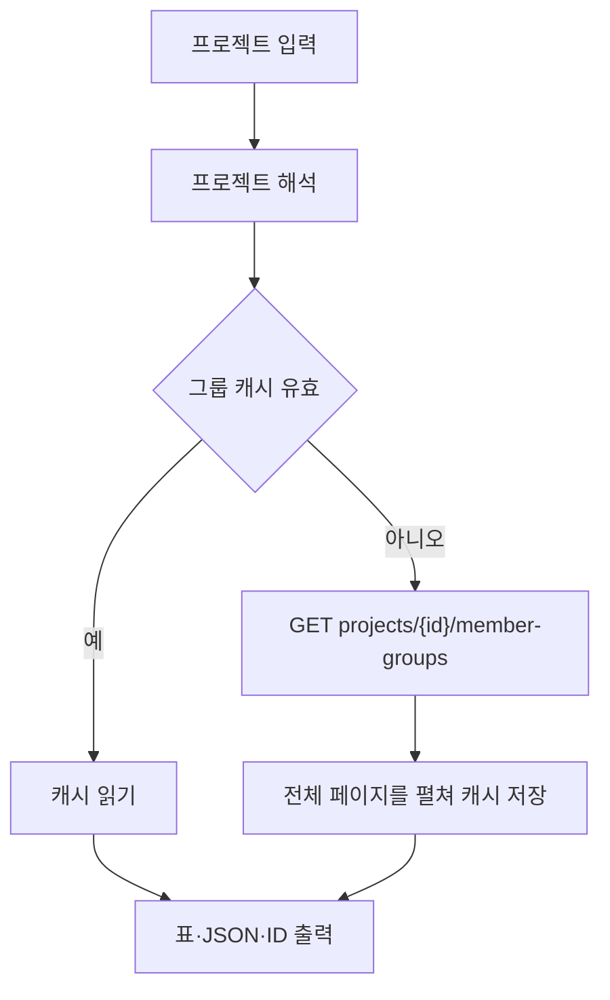

- 멤버 그룹 캐시 TTL은 24시간이고 API 페이지 크기는 100이다.

## 댓글 흐름

### `post comment list`, `latest`, `get`

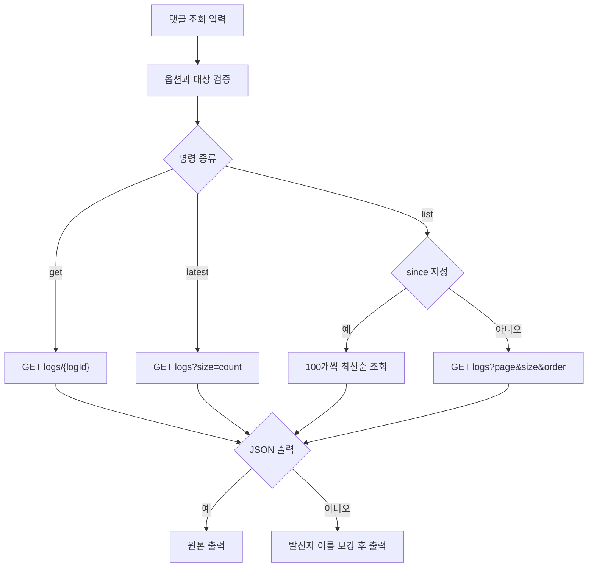

- `latest` 개수는 1에서 100 사이다. `latest`와 페이지·크기·정렬·기간 조건을 함께 쓰면 종료 코드 3으로 끝난다.
- `since`는 100개씩 최신순으로 읽다가 기준보다 오래된 댓글을 만나면 멈춘다. 오름차순 출력은 모은 뒤 뒤집는다.
- 이름 보강이 실패하면 경고하고 멤버 ID를 남긴다. JSON은 파이프라인 호환을 위해 원본을 유지한다.

### `post comment add`

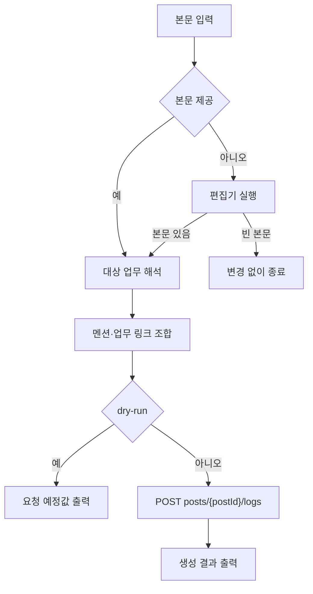

- HTML 댓글에 마크다운 멘션이나 업무 링크를 넣으면 종료 코드 3으로 끝난다.

### `post comment edit`

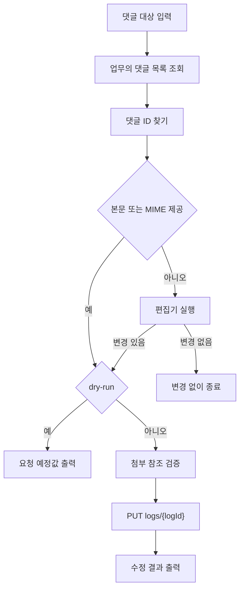

- 댓글 ID를 찾지 못하면 오류 메시지를 쓰고 종료 코드 1로 끝난다.
- MIME 형식만 바꾸면 기존 본문을 다시 보낸다. HTML과 마크다운 합성 옵션을 함께 쓰면 종료 코드 3으로 끝난다.
- 기존 첨부 참조가 사라지면 업무 수정과 같은 확인 정책을 적용한다.

### `post comment delete`

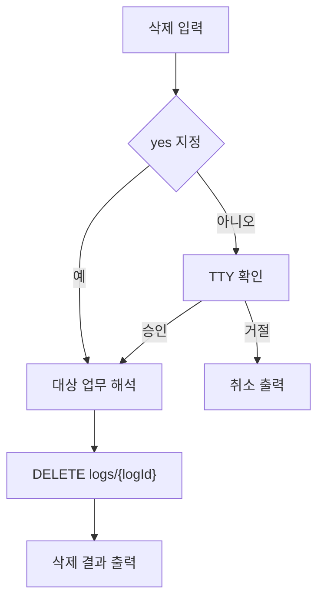

- `--yes`가 없는 비대화형 환경에서는 설정이나 API를 읽기 전에 종료 코드 3으로 끝난다.
- 확인의 기본값은 아니오이며, 거절은 API를 호출하지 않고 성공으로 끝난다.

## 댓글 첨부파일 흐름 (ADR-024)

### `post comment file list`

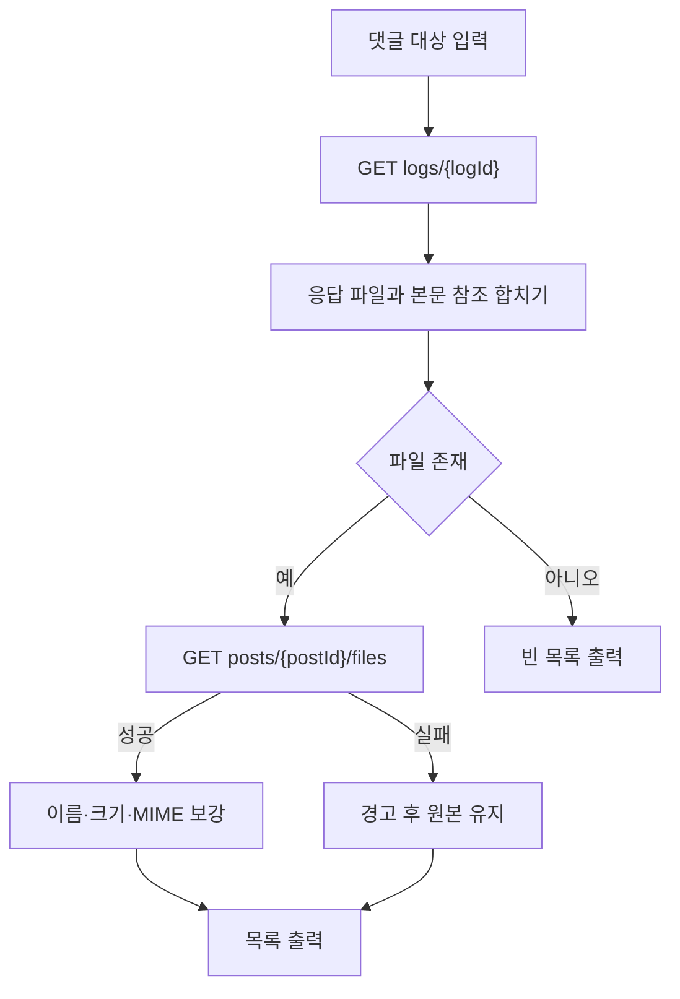

- 댓글 응답의 파일과 본문 `/files/{id}` 참조를 ID 기준으로 합친다. 메타데이터 보강 실패는 목록 조회를 실패시키지 않는다.

### `post comment file upload`

```mermaid
flowchart TD
    A["댓글과 파일 입력"] --> B["GET logs/{logId}"]
    B --> C{"댓글이 HTML"}
    C -->|예| D["종료 코드 3"]
    C -->|아니오| E["POST posts/{postId}/files"]
    E --> F["본문에 파일 참조 추가"]
    F --> G["PUT logs/{logId}"]
    G --> H["업로드 결과 출력"]
```

- 이미지 확장자는 이미지 마크다운으로, 나머지는 일반 링크로 본문에 추가한다.
- 파일 업로드 뒤 댓글 수정이 실패하면 참조되지 않은 파일이 업무에 남는다. 정리 방법을 경고하고 0이 아닌 종료 코드로 끝난다.

### `post comment file download`

```mermaid
flowchart TD
    A["댓글·파일 ID 입력"] --> B["업무 대상 해석"]
    B --> C["GET files/{fileId}?media=raw"]
    C --> D["리다이렉트 URL 다운로드"]
    D --> E["안전한 파일명으로 저장"]
    E --> F["저장 경로 출력"]
```

- 댓글 ID는 입력 형태를 통일하기 위해 받지만 다운로드 API 경로에는 쓰지 않는다.

### `post comment file delete`

```mermaid
flowchart TD
    A["삭제 입력"] --> B["공통 삭제 확인"]
    B --> C["GET logs/{logId}"]
    C --> D{"본문 참조 존재"}
    D -->|아니오| E["종료 코드 3"]
    D -->|예| F["참조를 뺀 본문 PUT"]
    F --> G["DELETE posts/{postId}/files/{fileId}"]
    G --> H["삭제 결과 출력"]
```

- HTML 댓글에서도 과거 CLI가 남긴 마크다운 참조를 찾아 제거한다.
- 본문 수정과 파일 삭제는 원자적이지 않다. 어느 단계에서 실패했는지와 남은 정리 작업을 경고하고 오류로 끝난다.

## 참조자(cc) / 담당자(to) 변경 흐름 (ADR-025)

### `post create`의 참여자 처리

```mermaid
flowchart TD
    A["멤버·그룹 입력"] --> B["프로젝트 멤버·그룹 캐시 조회"]
    B --> C["이름·이메일·ID 해석"]
    C --> D["그룹 멤버 펼치기"]
    D --> E["중복 제거"]
    E --> F["POST 요청의 to·cc 구성"]
```

- 15자리 이상 숫자는 조직 멤버 ID로 바로 쓰고, 이메일은 정확히 일치해야 한다. 이름·그룹 코드의 일치 결과가 여러 개면 후보와 함께 종료 코드 3으로 끝난다.

### `post edit`의 참여자 처리

```mermaid
flowchart TD
    A["기존 업무 조회"] --> B["기존 to·cc 읽기"]
    B --> C{"clear 지정"}
    C -->|예| D["기존 목록 비우기"]
    C -->|아니오| E["기존 목록 유지"]
    D & E --> F["입력 멤버·그룹 해석"]
    F --> G["추가·제거와 중복 제거"]
    G --> H["PUT 요청의 to·cc 구성"]
```

- 참여자 변경 옵션 하나만 있어도 비대화형 수정 경로로 들어간다.
- 태그 변경 옵션이 없으면 `tagIds`를 보내지 않아 기존 태그를 보존한다.

## 템플릿으로 정형 업무 생성 흐름 (ADR-027)

### `project templates`

```mermaid
flowchart TD
    A["프로젝트 입력"] --> B["프로젝트 해석"]
    B --> C{"템플릿 캐시 유효"}
    C -->|예| D["캐시 읽기"]
    C -->|아니오| E["GET projects/{id}/templates"]
    E --> F["전체 페이지를 캐시 저장"]
    D & F --> G["목록 출력"]
```

- 템플릿 캐시 TTL은 24시간이고 API 페이지 크기는 100이다.

### 템플릿을 지정한 `post create`

```mermaid
flowchart TD
    A["템플릿 이름 입력"] --> B["템플릿 캐시에서 해석"]
    B --> C["GET templates/{templateId}?interpolation=true"]
    C --> D["템플릿 필드 읽기"]
    D --> E["사용자 입력으로 항목별 덮어쓰기"]
    E --> F["일반 post create 흐름"]
```

- 템플릿 이름이 없거나 여러 개와 맞으면 후보와 함께 종료 코드 3으로 끝난다.
- 사용자 제목·본문·담당자·참조자·태그가 있으면 해당 템플릿 값을 대신한다.

## 상위 업무 변경 흐름 (Issue #60)

### `post edit --parent`

```mermaid
flowchart TD
    A["상위 업무 입력"] --> B{"다른 비대화형 옵션"}
    B -->|없음| C["대화형 경로에서 경고 후 무시"]
    B -->|있음| D["대상과 상위 업무 해석"]
    D --> E["PUT posts/{postId}"]
    E --> F["POST set-parent-post"]
    F --> G["수정 결과 출력"]
```

- 상위 업무는 `project/number` 또는 업무 ID로 해석한다. 없거나 모호하면 종료 코드 3으로 끝난다.
- 업무 본문 수정과 상위 업무 설정은 서로 다른 요청이다. 두 번째 요청이 실패하면 첫 번째 수정은 남고 오류로 끝난다.
- 상위 업무 해제 API는 없어 이 명령으로 최상위 업무로 바꿀 수 없다.

## 업무 메타데이터 흐름 (ADR-019)

### 메타데이터를 지정한 `post create`

```mermaid
flowchart TD
    A["태그·부모·워크플로우·마일스톤 입력"] --> B["프로젝트 해석"]
    B --> C["태그·부모·마일스톤 병렬 해석"]
    C --> D["필수·단일 선택 태그 검증"]
    D --> E["POST projects/{id}/posts"]
    E --> F{"워크플로우 지정"}
    F -->|예| G["POST set-workflow"]
    F -->|아니오| H["결과 출력"]
    G --> H
```

- 태그, 마일스톤, 워크플로우 캐시 TTL은 24시간이다. 이름이 없거나 모호하면 후보와 함께 종료 코드 3으로 끝난다.
- 필수 태그 그룹이 비었거나 단일 선택 그룹에 여러 태그가 있으면 생성 API를 호출하지 않는다.

### 태그를 바꾸는 `post edit`

```mermaid
flowchart TD
    A["기존 업무 조회"] --> B["기존 태그 읽기"]
    B --> C{"tag-clear"}
    C -->|예| D["기존 태그 비우기"]
    C -->|아니오| E["기존 태그 유지"]
    D & E --> F["tag-remove 제거"]
    F --> G["tag 추가와 중복 제거"]
    G --> H["필수·단일 선택 검증"]
    H --> I["PUT posts/{postId}"]
```

- 태그 변경 옵션만으로 비대화형 수정 경로에 들어가며, 기존 제목과 본문을 함께 다시 보낸다.

## 프로젝트 태그 관리 흐름 (ADR-041)

### `project tags`와 `project tags list`

```mermaid
flowchart TD
    A["프로젝트 입력"] --> B["프로젝트 해석"]
    B --> C{"태그 캐시 유효"}
    C -->|예| D["캐시 읽기"]
    C -->|아니오| E["GET projects/{id}/tags"]
    E --> F["전체 페이지를 캐시 저장"]
    D & F --> G["태그 목록 출력"]
```

- 두 명령은 같은 목록 흐름을 사용한다. 태그 캐시 TTL은 24시간이고 API 페이지 크기는 100이다.

### `project tags create`

```mermaid
flowchart TD
    A["이름과 색 입력"] --> B["프로젝트 해석"]
    B --> C["이름과 6자리 색 검증"]
    C --> D["POST projects/{id}/tags"]
    D --> E["프로젝트 태그 캐시 삭제"]
    E --> F["생성 결과 출력"]
```

- 색을 생략하면 `e0e0e0`을 쓰고 앞의 `#`은 제거한다. 6자리 16진수가 아니면 종료 코드 3으로 끝난다.
- 생성 뒤 캐시 삭제가 실패해도 경고만 내고 생성은 성공으로 끝난다.

### `project tags group`

```mermaid
flowchart TD
    A["그룹 이름과 변경값 입력"] --> B["변경값 존재 검증"]
    B --> C["프로젝트와 태그 캐시 조회"]
    C --> D["그룹 해석"]
    D --> E["지정하지 않은 현재 값 유지"]
    E --> F["PUT tag-groups/{groupId}"]
    F --> G["프로젝트 태그 캐시 삭제"]
    G --> H["변경 결과 출력"]
```

- 필수 여부와 단일 선택 여부를 하나도 지정하지 않으면 종료 코드 3으로 끝난다.
- 태그가 하나도 없는 그룹은 태그 목록에서 찾을 수 없다. 캐시 삭제 실패는 경고만 남긴다.

## 업무 워크플로우 변경 흐름

### `post done`

```mermaid
flowchart TD
    A["업무 대상 입력"] --> B["업무 해석"]
    B --> C["POST posts/{postId}/set-done"]
    C --> D["완료 결과 출력"]
```

- 입력 형태가 충돌하거나 업무를 찾지 못하면 API 호출 전에 종료 코드 3으로 끝난다.

### `post workflow`

```mermaid
flowchart TD
    A["업무와 워크플로우 입력"] --> B["입력 형태 정규화"]
    B --> C["업무 해석"]
    C --> D["워크플로우 캐시 조회"]
    D --> E["class 또는 이름 해석"]
    E --> F["POST posts/{postId}/set-workflow"]
    F --> G["변경 결과 출력"]
```

- 워크플로우 값이 없거나 이름이 여러 개와 맞으면 후보와 함께 종료 코드 3으로 끝난다. class는 이름보다 먼저 정확히 일치시킨다.
- 워크플로우 캐시 TTL은 24시간이다.

## 위키 흐름

### `wiki list`

```mermaid
flowchart TD
    A["목록 조건 입력"] --> B{"검색어 지정"}
    B -->|아니오| C["GET wiki/v1/wikis?page&size"]
    B -->|예| D["100개씩 전체 위키 조회"]
    D --> E["이름 부분 일치 필터"]
    C & E --> F["프로젝트 코드 지도 준비"]
    F -->|성공| G["프로젝트 코드 연결"]
    F -->|실패| H["프로젝트 ID 유지"]
    G & H --> I["목록 출력"]
```

- 검색어는 이름에서 대소문자를 구분하지 않고 찾는다. 검색과 함께 명시한 페이지·크기는 무시하고 경고한다.
- 검색 결과가 없으면 경고한 뒤 빈 목록을 출력한다. 프로젝트 코드 조회가 실패해도 위키 목록은 실패시키지 않는다.

### `wiki pages`

```mermaid
flowchart TD
    A["프로젝트와 부모 입력"] --> B["프로젝트 해석"]
    B --> C["프로젝트의 wikiId 해석"]
    C --> D["GET wikis/{wikiId}/pages"]
    D --> E["목록 출력"]
```

- 프로젝트에 위키가 없으면 종료 코드 3으로 끝난다. 부모 페이지가 있으면 `parentPageId`로 보낸다.

### `wiki tree`

```mermaid
flowchart TD
    A["프로젝트와 깊이 입력"] --> B["깊이 검증"]
    B --> C["wikiId 해석"]
    C --> D["최상위 페이지 GET"]
    D --> E{"깊이 도달 또는 자식 없음"}
    E -->|아니오| F["현재 레벨 자식 병렬 GET"]
    F --> E
    E -->|예| G["계층 트리 출력"]
```

- 깊이는 1 이상의 정수여야 하며 아니면 종료 코드 3으로 끝난다.
- 같은 레벨의 자식 조회는 10개씩 병렬로 처리한다.

### `wiki page get`

```mermaid
flowchart TD
    A["페이지 대상 입력"] --> B{"입력 형태"}
    B -->|URL| C["URL에서 wikiId·pageId 추출"]
    B -->|id와 project| D["프로젝트에서 wikiId 해석"]
    B -->|id만| E["GET wiki/v1/pages/{pageId}"]
    B -->|project pageId| D
    C & D --> F["GET wikis/{wikiId}/pages/{pageId}"]
    E --> G["페이지 출력"]
    F --> G
```

- 입력 형태가 충돌하거나 빠지면 종료 코드 3으로 끝난다. 15자리 이상 숫자 프로젝트 값은 프로젝트 ID로 바로 쓴다.
- `dooray://.../pages/{pageId}`에서 앞 숫자는 프로젝트 ID가 아니다. 페이지 ID만 `--id`에 주는 경로를 사용한다.

### `wiki page create`

```mermaid
flowchart TD
    A["프로젝트와 페이지 입력"] --> B["wikiId 해석"]
    B --> C{"부모 지정"}
    C -->|예| D["입력 부모 사용"]
    C -->|아니오| E["위키 캐시에서 홈 페이지 해석"]
    D & E --> F["POST wikis/{wikiId}/pages"]
    F --> G["생성 결과 출력"]
```

- 본문이 없으면 빈 본문으로 생성한다. 위키 캐시 TTL은 24시간이다.

### `wiki page edit`

```mermaid
flowchart TD
    A["수정 입력"] --> B["페이지 대상 해석"]
    B --> C{"제목·본문·MIME 제공"}
    C -->|없음| D["페이지 GET 후 편집기 실행"]
    D -->|변경 있음| E["PUT pages/{pageId}"]
    D -->|변경 없음| F["변경 없이 종료"]
    C -->|있음| G{"변경 조합"}
    G -->|제목만| H["PUT pages/{pageId}/title"]
    G -->|본문만| I["MIME 조회 후 PUT content"]
    G -->|MIME만| J["본문 조회 후 PUT content"]
    G -->|제목과 본문| E
    E & H & I & J --> K["수정 결과 출력"]
```

- 본문과 MIME을 함께 주면 기존 페이지를 조회하지 않고 콘텐츠를 수정한다. 둘 중 하나만 주면 빠진 값을 조회한다.
- 편집기 내용이 바뀌지 않으면 API를 호출하지 않는다.

### `wiki page delete`

```mermaid
flowchart TD
    A["삭제 입력"] --> B["공통 삭제 확인"]
    B --> C["페이지 대상 해석"]
    C --> D["DELETE wikis/{wikiId}/pages/{pageId}"]
    D --> E["삭제 결과 출력"]
```

- 확인은 설정·대상 해석보다 먼저 한다. 자식 페이지는 서버가 삭제한 페이지의 부모로 다시 연결한다.

### `wiki page move`

```mermaid
flowchart TD
    A["페이지·새 부모 입력"] --> B["옵션 조합 검증"]
    B --> C["현재 페이지 대상 해석"]
    C --> D{"대상 위키 지정"}
    D -->|이름·코드| E["대상 wikiId 해석"]
    D -->|숫자 ID·없음| F["대상 또는 현재 wikiId 사용"]
    E & F --> G["POST pages/{pageId}/move"]
    G --> H["이동 결과 출력"]
```

- 새 부모는 필수다. 특정 앞 페이지와 맨 앞 배치를 함께 지정하면 종료 코드 3으로 끝난다.
- 하위 페이지도 기본으로 함께 옮긴다. 제외 옵션은 `withChildren=false`, 맨 앞 배치는 `beforePageId=0`으로 보낸다.

## 메신저 흐름

### `messenger send`

```mermaid
flowchart TD
    A["수신자와 본문 입력"] --> B{"수신자 형태"}
    B -->|15자리 이상 ID| C["GET common/v1/members/{id}"]
    B -->|이메일| D["GET common/v1/members 검색"]
    B -->|그 밖| E["종료 코드 3"]
    C & D --> F["본문·파일·편집기 처리"]
    F --> G["POST messenger/v1/channels/direct-send"]
    G --> H["전송 결과 출력"]
```

- 수신자와 비어 있지 않은 본문은 필수다. 이메일 검색은 정확히 한 멤버와 일치해야 한다.
- 편집기에서 빈 본문이 나오면 취소가 아니라 종료 코드 3으로 끝난다.

### `messenger channel-send`

```mermaid
flowchart TD
    A["대화방과 본문 입력"] --> B{"대화방 값"}
    B -->|15자리 이상 ID| C["ID 바로 사용"]
    B -->|이름| D["GET messenger/v1/channels"]
    D --> E["제목 정확·부분 일치 해석"]
    C & E --> F["본문·파일·편집기 처리"]
    F --> G["POST channels/{channelId}/logs"]
    G --> H["전송 결과 출력"]
```

- 대화방 이름이 없거나 여러 개와 맞으면 후보와 함께 종료 코드 3으로 끝난다.
- 대화방과 비어 있지 않은 본문은 필수다.

### `messenger thread-send`

```mermaid
flowchart TD
    A["스레드 입력"] --> B["옵션 조합 검증"]
    B --> C["대화방 해석"]
    C --> D["본문 읽기"]
    D --> E{"기존 log 지정"}
    E -->|예| F["POST logs/{logId}/threads"]
    E -->|아니오| G["새 스레드 본문 읽기"]
    G --> H["POST channels/{channelId}/threads"]
    F & H --> I["전송 결과 출력"]
```

- 기존 로그 ID와 새 스레드 본문을 함께 주면 새 스레드 본문을 무시한다는 경고를 낸다.
- 본문과 스레드 본문 양쪽에서 표준 입력을 동시에 읽으려 하면 종료 코드 3으로 끝난다.
- API 응답에 대화방 ID가 없으면 성공 응답이어도 오류로 끝난다.

### `messenger logs`

```mermaid
flowchart TD
    A["대화방과 개수 입력"] --> B["개수 검증"]
    B --> C["대화방 해석"]
    C --> D["GET channels/{channelId}/logs?size"]
    D --> E{"출력 형식"}
    E -->|JSON| F["최신순 원본 출력"]
    E -->|표·quiet| G["오래된 순서로 뒤집기"]
    G --> H["멤버 발신자 이름 병렬 조회"]
    H --> I["표·ID 출력"]
```

- 개수는 1에서 1000 사이의 정수여야 하며 아니면 종료 코드 3으로 끝난다.
- 멤버 이름 조회가 실패하면 ID를 남긴다. 발신자가 멤버가 아니면 `sender.type`을 표시한다.
- API가 `hasMore=true`를 돌려주면 더 오래된 메시지는 이 API로 페이지 이동할 수 없다는 경고를 낸다.

## 위키 페이지 첨부파일 흐름 (Issue #70, ADR-029)

### `wiki page file list`

```mermaid
flowchart TD
    A["페이지 대상 입력"] --> B["페이지 해석"]
    B --> C["GET wikis/{wikiId}/pages/{pageId}"]
    C --> D["일반 파일과 인라인 이미지 합치기"]
    D --> E["목록 출력"]
```

- 일반 첨부와 인라인 이미지를 같은 목록으로 출력한다.

### `wiki page file upload`

```mermaid
flowchart TD
    A["페이지·파일·유형 입력"] --> B["유형 검증"]
    B --> C["페이지 해석"]
    C --> D["type 뒤 file 순서로 폼 구성"]
    D --> E["POST pages/{pageId}/files"]
    E -->|307| F["리다이렉트 URL에 다시 POST"]
    E -->|성공| G["업로드 결과 출력"]
    F --> G
```

- 유형은 `general` 또는 `inline_image`만 받으며, 그 밖의 값은 종료 코드 3으로 끝난다.
- 307 리다이렉트 뒤에도 새 폼을 만들고 `type`, `file` 순서를 유지한다.
- 인라인 이미지 성공 출력에는 본문에 넣을 마크다운 조각을 함께 넣는다.

### `wiki page file download`와 `download-all`

```mermaid
flowchart TD
    A["다운로드 입력"] --> B["페이지 해석"]
    B --> C{"단일 또는 전체"}
    C -->|단일| D["GET files/{fileId}"]
    C -->|전체| E["페이지 GET 후 파일 목록 합치기"]
    E --> F["각 파일을 차례로 GET"]
    D & F --> G["307 URL에서 파일 받기"]
    G --> H["안전한 파일명으로 저장"]
    H --> I["저장 결과 출력"]
```

- 다운로드 API가 307이 아닌 상태를 돌려주거나 위치 헤더가 없으면 종료 코드 1로 끝난다.
- 전체 다운로드는 일반 첨부와 인라인 이미지를 모두 받는다. 일부 파일이 실패하면 나머지를 계속 받은 뒤 종료 코드 1로 끝난다.

### `wiki page file delete`

```mermaid
flowchart TD
    A["삭제 입력"] --> B["공통 삭제 확인"]
    B --> C["페이지 해석"]
    C --> D["DELETE pages/{pageId}/files/{fileId}"]
    D --> E["삭제 결과 출력"]
```

- 확인을 거절하면 페이지 해석이나 API 호출 없이 성공으로 끝난다.

## 위키 페이지 댓글 흐름

### `wiki page comment list`와 `latest`

```mermaid
flowchart TD
    A["페이지와 조회 범위 입력"] --> B["페이지 해석"]
    B --> C{"명령 종류"}
    C -->|list| D["GET comments?page&size"]
    C -->|latest| E["GET comments?page=0&size=1"]
    D --> F["목록 출력"]
    E -->|결과 있음| G["댓글 출력"]
    E -->|결과 없음| H["댓글 없음 출력"]
```

- `list`는 `latest` 값이 있으면 그 값을 크기로 쓰고, 아니면 명시한 크기나 기본값 20을 쓴다. 코드에서 크기 상한을 별도로 검사하지 않는다.

### `wiki page comment get`

```mermaid
flowchart TD
    A["페이지·댓글 대상 입력"] --> B["입력 형태 해석"]
    B --> C["페이지 해석"]
    C --> D["GET comments/{commentId}"]
    D --> E["댓글 출력"]
```

- 프로젝트·페이지·댓글 위치 인자와 ID·URL 옵션의 조합이 맞지 않으면 종료 코드 3으로 끝난다.

### `wiki page comment add`

```mermaid
flowchart TD
    A["본문 입력"] --> B["입력 충돌 검증"]
    B --> C["페이지 해석"]
    C --> D{"본문 제공"}
    D -->|아니오| E["편집기 실행"]
    D -->|예| F["POST pages/{pageId}/comments"]
    E -->|빈 본문| G["변경 없이 종료"]
    E -->|본문 있음| F
    F --> H["생성 결과 출력"]
```

- 본문과 본문 파일을 함께 주는 등 입력이 충돌하면 API 호출 전에 종료 코드 3으로 끝난다.

### `wiki page comment edit`

```mermaid
flowchart TD
    A["댓글 대상 입력"] --> B["페이지 해석"]
    B --> C["GET comments/{commentId}"]
    C --> D{"새 본문 제공"}
    D -->|아니오| E["편집기 실행"]
    D -->|예| F["PUT comments/{commentId}"]
    E -->|빈 값·변경 없음| G["변경 없이 종료"]
    E -->|변경 있음| F
    F --> H["수정 결과 출력"]
```

- 편집기 결과가 비었거나 기존 본문과 같으면 수정 API를 호출하지 않는다.

### `wiki page comment delete`

```mermaid
flowchart TD
    A["삭제 입력"] --> B["공통 삭제 확인"]
    B --> C["페이지·댓글 해석"]
    C --> D["DELETE comments/{commentId}"]
    D --> E["삭제 결과 출력"]
```

- 확인은 페이지와 댓글 입력 해석보다 먼저 한다.

## 피드백 흐름 (ADR-022/023)

### `feedback`

```mermaid
flowchart TD
    A["제목·본문 입력"] --> B{"last 지정"}
    B -->|예| C["기록된 명령과 오류 읽기"]
    B -->|아니오| D["본문 조합"]
    C --> D
    D --> E["제목·라벨·본문 보완"]
    E --> F["환경정보와 함께 본문 구성"]
    F --> G{"dry-run"}
    G -->|예| H["예정 본문 출력"]
    G -->|아니오| I{"대화형 확인 필요"}
    I -->|예| J["미리보기와 확인"]
    I -->|아니오| K["gh 설치 확인"]
    J -->|승인| K
    J -->|거절| L["취소 출력"]
    K --> M["gh issue create"]
    M --> N["등록 결과 출력"]
```

- `--last`인데 기록이 없거나 제목·본문이 비면 종료 코드 3으로 끝난다.
- 제목을 옵션으로 주지 않은 대화형 경로만 등록 전 미리보기와 기본값 예인 확인을 거친다.
- `dry-run`은 `gh` 설치 여부를 검사하지 않는다. `gh issue create`가 실패하면 종료 코드 3으로 끝나며 임시 본문 파일은 항상 지운다.

## 파이프라인 활용

### 구조화 출력 파이프라인

```mermaid
flowchart TD
    A["조회 명령 입력"] --> B["설정·대상·옵션 검증"]
    B --> C["Dooray API 호출"]
    C --> D{"출력 형식"}
    D -->|json| E["JSON을 표준 출력"]
    D -->|quiet| F["ID를 표준 출력"]
    D -->|기본| G["사람용 표를 표준 출력"]
    E & F --> H["다음 프로세스의 표준 입력"]
```

- 경고와 오류는 표준 오류로 보내 구조화된 표준 출력을 섞지 않는다.
- 일부 조회 명령은 JSON에서 이름 보강이나 순서 뒤집기를 하지 않고 API 원본을 유지한다.

## 첨부파일 흐름

### `post file list`

```mermaid
flowchart TD
    A["업무 대상 입력"] --> B["업무 해석"]
    B --> C["GET posts/{postId}/files"]
    C --> D["목록 출력"]
```

- 목록은 업무 단위 첨부 API 응답을 출력한다.

### `post file upload`

```mermaid
flowchart TD
    A["업무와 파일 입력"] --> B["업무 해석"]
    B --> C["POST posts/{postId}/files"]
    C -->|307| D["리다이렉트 URL에 다시 POST"]
    C -->|성공| E["업로드 결과 출력"]
    D --> E
```

- 리다이렉트 위치 헤더가 없거나 파일 서버가 실패하면 종료 코드 1로 끝난다.

### `post file download`와 `download-all`

```mermaid
flowchart TD
    A["다운로드 입력"] --> B["업무 해석"]
    B --> C{"단일 또는 전체"}
    C -->|단일| D["파일 ID로 다운로드"]
    C -->|전체| E["GET posts/{postId}/files"]
    E --> F{"인라인 포함"}
    F -->|예| G["업무 GET 후 본문 참조 합치기"]
    F -->|아니오| H["첨부 목록만 사용"]
    G & H --> I["각 파일 다운로드"]
    D & I --> J["안전한 이름으로 저장"]
    J --> K["저장 결과 출력"]
```

- 전체 다운로드는 기본으로 본문 `/files/{id}` 참조도 합친다. `--no-inline`이면 업무 상세를 조회하지 않는다.
- 같은 ID는 한 번만 받는다. 일부 파일이 실패하면 나머지를 계속 받은 뒤 종료 코드 1로 끝난다.

### `post file delete`

```mermaid
flowchart TD
    A["삭제 입력"] --> B["공통 삭제 확인"]
    B --> C["업무 해석"]
    C --> D["DELETE posts/{postId}/files/{fileId}"]
    D --> E["삭제 결과 출력"]
```

- 확인을 거절하면 업무 해석이나 API 호출 없이 성공으로 끝난다.

## 삭제 확인 공통 흐름 (ADR-036)

### 삭제 명령의 사전 확인

```mermaid
flowchart TD
    A["삭제 명령 입력"] --> B{"yes 지정"}
    B -->|예| C["명령별 대상 해석"]
    B -->|아니오| D{"TTY 환경"}
    D -->|아니오| E["종료 코드 3"]
    D -->|예| F["기본값 아니오로 확인"]
    F -->|거절| G["취소 출력 후 성공 종료"]
    F -->|승인| C
    C --> H["명령별 DELETE 또는 선행 수정"]
    H --> I["명령별 결과 출력"]
```

- 위키 페이지·위키 파일·위키 댓글·업무 파일·업무 댓글·댓글 파일 삭제가 같은 확인 함수를 쓴다.
- 확인은 설정 읽기, 대상 해석, API 호출보다 먼저 실행한다.

## 메일 흐름

### `mail list`

```mermaid
flowchart TD
    A["목록 조건 입력"] --> B["메일 설정 검증"]
    B --> C["IMAP 연결과 INBOX 잠금"]
    C --> D{"조회 조건"}
    D -->|unread| E["안 읽은 UID 검색"]
    D -->|search| F["제목으로 UID 검색"]
    D -->|기본| G["전체 UID 검색"]
    E & F & G --> H["최근 UID의 envelope·flags 조회"]
    H --> I["날짜 내림차순 정렬"]
    I --> J["잠금 해제와 연결 종료"]
    J --> K["목록 출력"]
```

- 설정이 없으면 종료 코드 4, 인증이 실패하면 종료 코드 2, IMAP 통신이 실패하면 종료 코드 1로 끝난다.
- 사서함 잠금은 성공과 실패 경로에서 모두 해제하고 연결을 닫는다.

### `mail get`

```mermaid
flowchart TD
    A["메일 대상 입력"] --> B{"입력 형태"}
    B -->|32비트 이하 숫자| C["UID 바로 사용"]
    B -->|메일 ID·URL| D["ID에서 시각과 폴더 해석"]
    D --> E["앞뒤 하루 UID 검색"]
    E --> F["후보 envelope를 500개씩 조회"]
    F --> G["같은 초와 다음 초 후보 선별"]
    G -->|정확히 하나| C
    C --> H["IMAP에서 본문 조회"]
    H --> I["메일 상세 출력"]
```

- 웹 주소는 `inbox`, `sent`, `draft`, `archive`, `spam`, `trash` 폴더만 받는다. 주소가 아니거나 폴더가 없으면 `INBOX`를 쓴다.
- 메일 ID 검색 후보 상한은 2000개다. 후보 envelope는 500개씩 가져온다.
- 도착 시각이 빠졌거나, 같은 시각 후보가 여러 개거나, 조회 범위 경계 뒤에 후보가 더 있을 수 있으면 UID를 고르지 않고 종료 코드 1로 끝난다.

### `mail send`

```mermaid
flowchart TD
    A["수신자·제목·본문 입력"] --> B["메일 설정 검증"]
    B --> C["본문 파일 또는 본문 읽기"]
    C --> D["빈 본문 검증"]
    D --> E["SMTP 보안 연결"]
    E --> F["메일 전송"]
    F --> G["전송 결과 출력"]
```

- 본문 파일을 주면 인자 본문보다 우선한다. 본문이 비면 종료 코드 3으로 끝난다.
- 설정 누락, 인증 실패, SMTP 통신 실패의 종료 코드는 각각 4, 2, 1이다.

### `mail reply`

```mermaid
flowchart TD
    A["답장 대상과 본문 입력"] --> B{"yes 또는 TTY"}
    B -->|둘 다 아님| C["종료 코드 3"]
    B -->|가능| D["메일 설정과 본문 검증"]
    D --> E["get 흐름으로 원본 조회"]
    E --> F["수신자·제목·시각·UID 미리보기"]
    F --> G{"확인 필요"}
    G -->|거절| H["취소 출력"]
    G -->|승인·yes| I["SMTP로 답장 전송"]
    I --> J["전송 결과 출력"]
```

- 비대화형 환경에서 `--yes`가 없으면 설정이나 IMAP을 읽기 전에 종료 코드 3으로 끝난다.
- 확인의 기본값은 아니오다. 답장 제목에는 `Re:`를 붙이고 원본 메시지 ID를 `In-Reply-To`와 `References`에 넣는다.
- 본문 파일은 인자 본문보다 우선하며, 빈 본문은 종료 코드 3으로 끝난다.

### `mail logout`

```mermaid
flowchart TD
    A["logout 입력"] --> B{"yes 지정"}
    B -->|아니오| C{"TTY 환경"}
    C -->|아니오| D["종료 코드 3"]
    C -->|예| E["기본값 아니오로 확인"]
    B -->|예| F["메일 설정 읽기"]
    E -->|승인| F
    E -->|거절| G["취소 출력"]
    F --> H{"인증정보 존재"}
    H -->|예| I["IMAP 사용자명·비밀번호 제거"]
    H -->|아니오| J["제거할 정보 없음 출력"]
    I --> K["완료 출력"]
```

- 로그아웃은 IMAP 사용자명과 비밀번호만 제거하며 API 설정은 유지한다.
