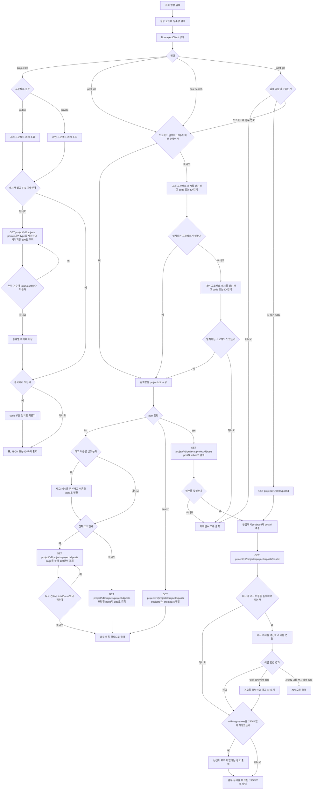
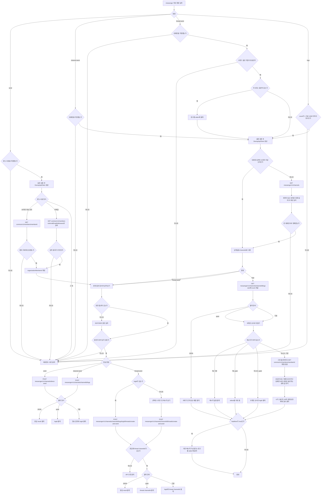

# dooray-cli User Flow

## 최초 설정: `dooray setup`

대화형 마법사로 필수 설정을 한 번에 완료한다.

```
dooray setup

? 회사 테넌트명을 입력하세요 (Dooray 접속 URL에서 확인: https://{tenant}.dooray.com) (<tenant>)
? API Endpoint를 선택하세요 (화살표로 선택)
❯ 민간 클라우드      https://api.dooray.com
  공공 클라우드      https://api.gov-dooray.com
  공공 업무망 클라우드 https://api.gov-dooray.co.kr
  금융 클라우드      https://api.dooray.co.kr
? API Key를 입력하세요 (발급: https://<tenant>.dooray.com/setting/api/token) ****

✓ API 연결 성공 (홍길동)

? 메일 기능을 사용하시겠습니까? (Y/n) Y
? IMAP 사용자 이메일 (설정 확인: https://<tenant>.dooray.com/setting/mail/general/read) user@example.com
? IMAP 비밀번호 ****

? Claude Code 스킬을 설치하시겠습니까? (Y/n) Y
✓ 스킬 설치 완료: ~/.claude/skills/dooray-cli

✓ 설정 완료. dooray doctor로 상태를 확인할 수 있습니다.
```

플로우:
1. 테넌트명 입력 (기본값: `<tenant>`) → API Key 발급·메일 설정 링크에 자동 반영
2. API Endpoint 선택 (4개 환경 중 택 1, 기본: 민간)
3. API Key 입력 (마스킹, 발급 링크 안내)
4. API 연결 테스트 → 실패 시 재입력 유도
5. 메일 사용 여부 → Y: IMAP 계정·비밀번호 입력 / n: 건너뛰기
6. Claude Code 스킬 설치 여부 → Y: `dooray skill install`과 같은 공용 설치 흐름 실행 / n: 건너뛰기
7. 모든 입력 완료 후 config.json에 한 번에 저장 (Ctrl+C 시 저장 안 됨)

재실행 시 기존 설정값이 기본값으로 표시된다.

config 미설정 상태에서 다른 커맨드 실행 시:

```
설정이 완료되지 않았습니다. 먼저 초기 설정을 진행하세요:
  dooray setup
```

### 수동 설정 (개별 키)

기존 `dooray config set/get` 커맨드로도 개별 설정이 가능하다.

```
dooray config set api-key <token>
dooray config set base-url https://api.dooray.com
dooray doctor
```

`api-key` 나 `base-url` 을 바꾸면 캐시 전체를 함께 지우고 그 사실을 알린다 (ADR-042).
이전 계정이나 이전 접속 환경의 프로젝트·멤버·태그가 남아 잘못 매칭되는 것을 막는다.
같은 값을 다시 설정하는 경우와 최초 설정에서는 지우지 않는다.
설정 파일이 손상됐거나 읽히지 않으면 `dooray config set` 은 기존 파일을 덮지 않고 오류로 끝난다.
`dooray setup` 으로 전체 설정을 저장하는 데 성공하면 이전 계정을 알 수 없으므로 캐시 전체를 지운다.

값에 `-` 를 주면 stdin 에서 읽는다. 토큰을 명령 인자로 넘기지 않으려는 경로다.

```
printf '%s' "$TOKEN" | dooray config set api-key -
```

인자로 넘기면 셸 기록과 프로세스 목록에 값이 남는다.
stdin 으로 받은 값은 양끝 공백을 지운 뒤 저장하고, 비어 있으면 저장하지 않고 종료 코드 3 으로 끝낸다.

## Claude Code 스킬 관리 흐름

스킬 관리는 API·메일 설정과 독립적으로 실행한다.

```bash
dooray skill status          # 설치 상태와 CLI·스킬 버전 확인
dooray skill install         # 미설치 상태에서 설치
dooray skill update          # 현재 CLI 패키지에 포함된 스킬로 갱신
dooray skill update --force  # 관리되지 않은 기존 파일을 백업한 뒤 교체
```

`status`는 상태 조회 자체가 성공하면 종료 코드 0을 반환한다.
기본 출력은 사람이 읽는 설명, `--json`은 아래 구조, `--quiet`은 상태 토큰 하나를 출력한다.

```json
{
  "schemaVersion": 1,
  "status": "current",
  "destination": "/home/user/.claude/skills/dooray-cli",
  "source": "/package/skills/dooray-cli",
  "currentVersion": "0.14.1",
  "installedVersion": "0.14.1",
  "linkTarget": "/home/user/.local/share/dooray-cli/skills/0.14.1-<64hex>",
  "managed": true
}
```

상태 토큰은 다음과 같다.

- `missing`: 설치되지 않음
- `current`: 현재 CLI 패키지와 일치
- `outdated`: 이전 패키지 또는 이전 관리 저장소를 가리킴
- `broken`: 심볼릭 링크 대상이 없음
- `unmanaged`: 사용자가 직접 만든 파일·디렉터리 또는 알 수 없는 링크
- `modified`: 관리형 설치의 콘텐츠 해시가 매니페스트와 다름
- `corrupt`: 관리형 매니페스트가 없거나 스키마 검증에 실패

관리형 링크의 상세 판정은 다음과 같다.

| 조건 | 상태 |
|---|---|
| 매니페스트가 유효하고 경로의 버전·digest, 실제 콘텐츠 digest, 현재 package source의 버전·digest가 모두 일치 | `current` |
| 매니페스트와 경로·실제 콘텐츠가 유효하지만 현재 package source의 버전 또는 digest와 다름 | `outdated` |
| 매니페스트가 유효하고 경로의 version+digest와 일치하지만 실제 콘텐츠 digest가 매니페스트와 다름 | `modified` |
| 매니페스트 누락·형식 오류·package 식별자 불일치·경로의 version/digest 불일치 | `corrupt` |
| 관리 루트 밖의 npm package 직접 링크 | package 메타데이터가 유효하면 `outdated`, 아니면 `unmanaged` |

`install`과 `update`는 `current`에서 아무것도 바꾸지 않는다.
기존 패키지 경로를 가리키는 `outdated`·`broken` 링크는 안전하게 교체한다.
`unmanaged`·`modified`·`corrupt` 상태는 기본적으로 보존하고 종료 코드 3으로 실패한다.
`--force`를 지정하면 기존 항목을 같은 디렉터리에 백업한 뒤 교체하며, 활성 링크 전환에 실패하면 백업을 복구한다.

같은 version+digest의 canonical 저장 디렉터리가 수정되거나 손상된 경우에는 활성 링크 전환보다 먼저 저장 디렉터리를 `.backup-<UTC timestamp>-<basename>`으로 격리한다.
새 저장 디렉터리 전환에 실패하면 격리본을 복구하며, 성공하면 격리본을 보존한다.
저장 디렉터리 격리와 활성 링크 백업은 서로 다른 단계이며, 어느 단계든 실패하면 사용자 콘텐츠를 삭제하지 않는다.

스킬 본문은 `dataRoot/skills/<packageVersion>-<contentDigestHex>/`에 버전별로 보존한다.
`dataRoot`는 절대 경로 `XDG_DATA_HOME`이 있으면 `$XDG_DATA_HOME/dooray-cli`, 없거나 상대 경로이면 `~/.local/share/dooray-cli`다.
`contentDigestHex`는 매니페스트 `contentDigest`의 `sha256:` 접두사를 제거한 64자리 lowercase hex다.
`~/.claude/skills/dooray-cli`는 이 안정 저장소를 가리키므로 Node 버전별 npm 전역 경로가 바뀌어도 기존 설치가 끊어지지 않는다.
자동 `postinstall`, 이전 버전 자동 삭제, 자동 롤백 명령은 제공하지 않는다.

## 일반 조회 흐름



## 업무 생성 흐름

```
dooray post create my-project \
  --title "기능 구현" \
  --to "김철수" \                           # 이름 or 이메일로 멤버 지정
  --body-file task.md                       # 또는 --body - (stdin)
```

`--to` 멤버가 모호할 때:

```
Error: '김' matches multiple members:
  - 김철수 (1234567890123456789)
  - 김영희 (9876543210987654321)
Use full name or ID.
```

## 업무 수정 흐름 ($EDITOR)

```
dooray post edit my-project 42
```

1. API로 현재 업무 조회
2. 임시 파일 생성 (YAML frontmatter와 본문):

```yaml
---
subject: 현재 제목
priority: normal
due_date: 2026-04-30T18:00:00+09:00
to:
  - user@example.com
cc: []
---
본문 마크다운...
```

3. `$EDITOR` 실행 → 저장·종료
4. frontmatter 파싱 후:
   - member resolver 실행
   - API PUT 호출

`$EDITOR` 미설정 시:

```
Error: $EDITOR is not set. Set it with: export EDITOR=vim
```

## 캐시 흐름

- 커맨드 실행 시 캐시 자동 확인 → TTL 만료 시 자동 갱신
- 수동 조작:

```
dooray cache refresh     # 즉시 갱신
dooray cache clear       # 전체 삭제
```

TTL: projects·members 1시간, 나머지 24시간. 엔티티별 값과 근거는 `docs/data-schema.md` 의 TTL 설계 근거 표가 소유한다.

TTL 을 기다리지 않고 비워지는 경우가 세 가지 있다.

- 태그를 만들거나 태그 그룹 속성을 바꾸면 그 프로젝트의 태그 캐시를 지운다.
- `api-key` 나 `base-url` 이 실제로 바뀌면 캐시 전체를 지운다. 계정이나 접속 환경이 바뀌면
  남아 있는 모든 파일이 다른 곳의 데이터이기 때문이다.
- `dooray setup` 이 이전 설정 파일이 손상됐거나 읽히지 않는 상태에서 전체 설정을 저장하면 캐시 전체를 지운다.
  이전 계정을 알 수 없어 남은 캐시가 맞는지 판단할 수 없기 때문이다.

`dooray cache clear` 는 사용자가 명시적으로 요청한 작업이라 삭제에 실패하면 에러로 끝난다.
위 경우의 무효화는 부수 작업이라 실패해도 경고만 내고 원래 명령을 성공으로 끝낸다.

## 멤버 조회 흐름 (ADR-021)

```
dooray member list my-project              # 프로젝트 멤버 (이름·이메일·id)
dooray member get <member-id>              # 단건 조회
```

`post comment list` 의 Creator 컬럼은 자동으로 표시명으로 채워진다 (`--json` 은 파이프라인 호환을 위해 raw 를 유지한다).

## 댓글 흐름

```
dooray post comment list my-project 42         # 댓글 목록
dooray post comment add my-project 42 \         # 댓글 추가
  --body "확인했습니다" \
  --mention "김철수" \                          # @멘션 prepend
  --link-task my-project/41                     # 다른 업무 링크 append
dooray post comment edit my-project 42 \        # 댓글 수정 ($EDITOR)
  --comment-id <comment-id>
dooray post comment delete my-project 42 \      # 댓글 삭제 (confirm 기본, -y/--yes 로 생략)
  --comment-id <comment-id>
```

post `--id`/`--url` 모드도 같이 지원한다. `dooray post comment list --id <postId>` 또는 첫 positional 에 Dooray URL 을 직접 넣는다.

## 댓글 첨부파일 흐름 (ADR-024)

`post comment file *` 4 명령의 사용자 멘탈 모델은 "댓글 첨부"다.
댓글 전용 첨부 엔드포인트가 없어 댓글 조회·수정 API와 post-level files API를 명령별로 조합한다.

```
dooray post comment file list my-project 42 <comment-id>            # 댓글 첨부 목록
dooray post comment file upload my-project 42 <comment-id> ./img.png   # 업로드
dooray post comment file download my-project 42 <comment-id> <file-id>  # 다운로드
dooray post comment file delete my-project 42 <comment-id> <file-id>    # 삭제 (confirm 기본, -y/--yes 로 생략)
```

`upload`는 파일명 확장자를 대소문자 구분 없이 판별해 댓글 본문 참조 형식을 정한다.

- `png`, `jpg`, `jpeg`, `gif`, `webp`, `bmp`, `svg`, `avif`, `heic`는 이미지 마크다운 ``을 추가한다.
- 그 외 확장자와 확장자 없는 파일은 일반 링크 `[파일명](/files/<file-id>)`를 추가한다.

`upload`은 파일을 올리기 전에 댓글을 조회해 본문 형식을 판정한다 (ADR-055).
`text/html` 이면 그 형식의 첨부 표기가 확인되지 않아 종료 코드 3으로 멈춘다.
업로드 뒤에 멈추면 어디에도 참조되지 않는 파일이 업무에 남기 때문에 판정이 업로드보다 앞선다.

`delete`는 두 참조 형식을 모두 제거한 뒤 post-level 파일을 삭제한다.
본문에서 참조를 찾지 못하면 본문도 파일도 건드리지 않고 종료 코드 3으로 멈춘다 (ADR-055).
`text/html` 본문에서도 마크다운 정규식으로 찾는다.
ADR-055 이전의 CLI가 `text/html` 댓글에 마크다운 참조를 평문으로 남겼고, 그것을 지울 경로가 여기뿐이다.
두 단계의 원자성은 보장하지 않으며 부분 성공 시 stderr 안내와 0이 아닌 종료 코드로 종료한다.

`list`는 첨부 경로가 둘로 갈리므로 두 출처를 합쳐서 보여준다.

- 웹 UI에서 첨부한 파일은 댓글 단건 조회 응답의 `files`에 들어온다. 본문 참조는 생기지 않는다.
- CLI `upload`가 올린 파일은 본문 마크다운 참조로만 남는다. 댓글의 `files`에는 들어가지 않는다.

`list`는 두 목록을 `id` 기준으로 합치고 `출처` 열로 어느 경로인지 구분한다.
댓글 응답의 `files`는 `name`과 `size`가 `null`이라, 업무 단위 첨부 목록을 한 번 더 조회해 이름·크기·MIME을 채운다.
이 보강 조회가 실패해도 목록 자체는 그대로 출력하고 채우지 못한 값만 `-`로 표시한다.

## 참조자(cc) / 담당자(to) 변경 흐름 (ADR-025)

기존 업무의 참조자·담당자에 멤버 또는 그룹 추가/제거.
자동화 시나리오: 신규 업무 생성 후 후속으로 특정 그룹을 참조에 첨부.
참여자 옵션이나 `--mime-type` 하나만 지정해도 비대화형 수정으로 실행하며 `$EDITOR` 를 열지 않는다.
이때 조회한 기존 제목과 본문을 `updatePost` 요청에 다시 사용하고, 태그 변경 옵션이 없으면 `tagIds` 를 보내지 않아 기존 태그를 보존한다.

```
# 멤버/그룹 추가 (append + dedupe)
dooray post edit my-project 42 \
  --cc 홍길동 --cc-group dev-team               # 이름·코드 부분일치
  --to 김철수

# 전체 비우고 신규만 (clear + 신규 입력)
dooray post edit my-project 42 \
  --cc-clear --cc 홍길동                         # 기존 cc 전부 제거 + 홍길동만

# 신규 업무 생성 시 그룹 cc 동봉
dooray post create my-project \
  --title "주간 audit 리포트" \
  --cc 홍길동 --cc-group dev-team               # post create 는 clear 없음

# 입력 형식 자동 분기 (Issue #58): 이름 / 이메일 / 15자리 이상 organizationMemberId
dooray post edit my-project 42 \
  --cc user@example.com \                       # 이메일 (동명이인 우회)
  --cc 1234567890123456789                       # organizationMemberId 직접
```

`--mention`, `--mention-group`, `--link-task`, `--parent` 는 참여자 옵션과 별개의 비대화형 진입 조건이다.
이 옵션들의 단독 호출 지원 여부는 각각의 흐름에서 다루며, 참여자 옵션 정책을 확장해 암묵적으로 바꾸지 않는다.

## 템플릿으로 정형 업무 생성 흐름 (ADR-027)

자동화 시나리오: 프로젝트의 정형 task (릴리스 플랜, 요청서, 공지 등) 를 매번 templateName 으로 인스턴스화.

```
# 1. 사용 가능한 템플릿 목록 (이름·ID 확인)
dooray project templates my-project

# 2. 템플릿으로 업무 생성 (body/users/tags 자동 채움 + ${year} 같은 시스템 매크로 치환)
dooray post create my-project --template "릴리스 플랜"

# 3. 사용자 옵션 override — 템플릿 위에 일부 필드만 다르게
dooray post create my-project --template "릴리스 플랜" \
  --title "v0.9 릴리스 계획" \
  --tag "p0"                       # 템플릿 tags 를 덮음
```

`interpolation=true` 가 기본이다. Dooray 가 `${year}`, `${month}` 같은 시스템 매크로를 응답에서 자동으로 치환한다.
사용자 정의 변수 (`--field key=value`) 는 본 release scope 외 (별도 후속).
사용자 옵션이 명시 입력되면 템플릿 값을 override.

## 상위 업무 변경 흐름 (Issue #60)

자동화 시나리오: 자식 업무를 먼저 만든 뒤 후속으로 부모를 지정하거나, 진행 중 부모-자식 관계 재구성.

```
# 상위 업무 설정/변경
dooray post edit my-project 42 --parent my-project/40    # project/number
dooray post edit --id <postId> --parent <parentPostId>   # 직접 postId
```

내부적으로 `client.updatePost` (subject/body/users) → `client.setPostParent` (별도 `POST .../set-parent-post` endpoint) 순차 호출.
둘 다 무관 endpoint 라 atomic 을 보장하지 않는다. 일부만 실패하면 stderr 로 안내한 뒤 non-zero 로 끝난다.

**한계**: Dooray API 가 `unset-parent-post` 미제공 → CLI 로 parent 해제 (top-level 화) 불가. 웹 UI 에서 수동 처리.

interactive ($EDITOR) 모드에서는 이 옵션들 무시 후 stderr 경고 (mention/link-task 와 동일 패턴).

## 업무 메타데이터 흐름 (ADR-019)

```
dooray post create my-project \
  --title "기능 구현" \
  --tag "frontend" --tag "p0" \                  # 반복 가능, mandatory-tag 그룹은 사전 검증
  --parent my-project/41 \                       # code/number 또는 raw postId
  --workflow "진행 중" \                         # 이름 lookup 후 setPostWorkflow 후속 호출
  --milestone "Sprint 17"                        # 이름 lookup
```

resolver 모호성 (이름 부분일치 복수 매칭) 시 에러와 후보 목록 출력.

`post edit` 에서 사후 태그 변경 (`--tag`/`--tag-clear`/`--tag-remove`) 도 동일 정책 (Issue #66, ADR-019 확장):

```
# 기존 태그 유지 + 신규 추가 (dedupe)
dooray post edit --id <postId> --tag "분류: <name>"

# 기존 태그 전부 비우고 신규만
dooray post edit --id <postId> --tag-clear --tag "분류: <name>"

# 특정 태그만 제거 (기존 유지)
dooray post edit --id <postId> --tag-remove "분류: <name>"
```

`--title`/`--body` 없이 단독으로 호출할 수 있고, 그때는 기존 본문을 자동으로 다시 보낸다.
mandatory tag 그룹 위반 시 친절한 에러.

## 프로젝트 태그 관리 흐름 (ADR-041)

태그를 업무에 붙이는 것과 별개로, 붙일 태그를 만드는 흐름이다.

```
dooray project tags my-project                              # 목록 (기존 호출 그대로 동작)
dooray project tags list my-project                         # 같은 동작

dooray project tags create my-project --name "배포환경:staging"
dooray project tags create my-project --name "배포환경:production" --color c6eab3
dooray project tags create my-project --name "긴급"          # 그룹 없는 개별 태그

dooray project tags group my-project "배포환경" --select-one  # 그룹에서 하나만 선택하게
```

`--name` 은 `"그룹명:태그명"` 이고 그룹명은 생략할 수 있다.
같은 그룹명으로 여러 번 만들면 그 그룹에 태그가 쌓인다.
`--color` 를 생략하면 `e0e0e0` 이 붙고, `#c6eab3` 처럼 `#` 을 붙여 넣어도 벗겨서 보낸다.

생성 직후 그 프로젝트의 태그 캐시를 지운다.
지우지 않으면 방금 만든 태그를 `post create --tag` 가 최대 24시간 찾지 못한다.

`group` 은 그룹의 필수 여부(`--mandatory`)와 단일 선택 여부(`--select-one`)만 바꾼다.
해제는 `--no-mandatory`, `--no-select-one` 이고, 지정하지 않은 쪽은 현재 값을 유지한다.
그룹 이름은 태그 목록에서 파생하므로 태그가 하나도 없는 그룹은 찾을 수 없다.

태그 이름·색상 수정과 태그 삭제는 공식 API 에 경로가 없어 제공하지 않는다.
그 두 가지는 웹 설정 화면에서 한다.

## 업무 워크플로우 변경 흐름

```
dooray post done my-project 42                  # 완료 상태로
dooray post workflow my-project 42 "review"     # 임의 상태로 (이름 또는 class)
```

`post done` 은 `set-done` endpoint 를 불러 완료 클래스의 대표 워크플로우로 옮기고,
완료 이전 담당자들의 상태도 함께 바꾼다. `post workflow` 는 `set-workflow` 로 임의 워크플로우로 옮기므로
완료 클래스로 옮기고 싶으면 `post done` 을, 그 밖의 상태로 옮기고 싶으면 `post workflow` 를 쓴다.

## 위키 흐름

```
dooray wiki list                                 # 위키 목록 (ID / Name / Project / Type)
dooray wiki list --search 설계                    # 이름 부분 일치, 대소문자 무시 (ADR-043)
dooray wiki pages my-project                     # root 페이지 목록
dooray wiki tree my-project                      # 페이지 계층 트리 (root 부터 재귀)
dooray wiki tree my-project --depth 2            # 손자까지만
dooray wiki page get my-project <page-id>        # 페이지 조회
dooray wiki page create my-project --title "설계" --body-file design.md
dooray wiki page edit my-project <page-id>       # $EDITOR 수정
dooray wiki page delete my-project <page-id>     # 페이지 삭제 (confirm 기본, -y/--yes 로 생략)
dooray wiki page move <project> <page-id> --parent <parent-page-id>
dooray wiki page move --id <page-id> --parent <parent-page-id> --no-children
dooray wiki page move --id <page-id> --parent <parent-page-id> --first
```

페이지 ID 하나만 아는 상태에서 시작하는 경로다 (Issue #154, ADR-045).
project 를 찾을 필요가 없다.

```
dooray wiki page get --id <page-id>
```

위키 자체를 이름으로 찾아야 할 때가 따로 있다 (ADR-043).
페이지 ID 를 모르거나 그 위키의 페이지 목록이나 트리를 보려 할 때다.

```
# 1. 위키를 이름으로 찾는다. Project 열의 값이 다음 명령의 project 인자다
dooray wiki list --search <위키 이름 일부>

# 2. 그 값으로 페이지 목록이나 트리를 본다
dooray wiki pages <project>
dooray wiki tree <project>
```

개인 프로젝트도 프로젝트 코드로도 projectId 로도 같은 명령을 쓴다 (ADR-054).
`resolveProject` 가 공용 목록에서 못 찾으면 private 목록을 받아 다시 찾고,
`resolveWiki` 는 공용과 private 두 캐시를 모두 본 뒤 거기서도 못 찾으면 private 목록을 받아 다시 찾는다.
사람이 `dooray project list --type private` 를 미리 부를 필요가 없다.

위키 본문의 페이지 링크는 `dooray://<orgId>/pages/<pageId>` 형태다.
앞 숫자는 orgId 이고 project 도 위키 ID 도 아니다.
그 값을 project 자리에 넣으면 `프로젝트에 위키가 없습니다` 로 끝난다.
`resolveProject` 가 15자리 이상 numeric 을 project ID 로 통과시키는데(ADR-030)
orgId 는 공용 목록에도 private 목록에도 없어 `resolveWiki` 가 끝내 찾지 못하기 때문이다.
뒤 숫자가 페이지 ID 이므로 그것만 떼어 `--id` 에 넣으면 project 없이 조회된다. 오류 안내가 그 방법을 알려준다.

`wiki page get` 은 `wiki page file` 과 `wiki page comment` 와 같은 네 가지 입력 형태를 받는다 (ADR-020, ADR-043).
`--id` 모드는 project 없이 단독으로 동작한다 (ADR-045).
`GET /wiki/v1/pages/{page-id}` 를 한 번 불러 응답의 wikiId 를 읽는다.
`--project` 는 선택이며 함께 주면 그 해석 호출을 아낀다.
`wiki page` 의 `edit`, `file`, `comment`, `delete` 도 같은 방식으로 `--id` 만 받는다.

```
dooray wiki page get --id <page-id>
dooray wiki page get --url "https://x.dooray.com/wiki/<wikiId>/<pageId>"
dooray wiki page get --id <page-id> --project my-project
```
하위 페이지는 기본으로 함께 이동한다.
이동할 때는 새 부모 페이지를 `--parent` 로 반드시 지정한다.

## 메신저 흐름



## 위키 페이지 첨부파일 흐름 (Issue #70, ADR-029)

페이지 첨부파일을 CLI 로 관리.
post file 명령군과 같은 구조다. `<project> <page-id>`, `--id`, `--url`, positional URL 을 모두 지원한다.

```
# 목록 (general 첨부 + inline image 둘 다 표시)
dooray wiki page file list my-project <page-id>

# 업로드 (기본 general — 페이지 하단 첨부 영역)
dooray wiki page file upload my-project <page-id> --file ./SKILL.md
# stdout: attachFileId + 본문 삽입용 markdown snippet 안내

# 인라인 이미지 업로드 (본문 markdown 은 사용자가 직접 박음 — 자동 합성 안 함)
dooray wiki page file upload my-project <page-id> --file ./diagram.png --type inline_image

# 다운로드
dooray wiki page file download my-project <page-id> --file-id <id> -o ./

# 페이지 모든 첨부 일괄 다운로드
dooray wiki page file download-all my-project <page-id> -o ./attachments/

# 삭제 (post file delete 와 동일 — confirm 기본, -y/--yes 로 생략)
dooray wiki page file delete my-project <page-id> --file-id <id>
```

활용 사례: 팀 위키에 스킬 파일 첨부 → 팀원이 `wiki page file download-all` 로 일괄 받아 `~/.claude/skills/` 에 그대로 설치.

## 위키 페이지 댓글 흐름

post comment 명령군과 동일 UX. 단 wiki comment 는 mention / cc / 첨부 파일 미지원 (Dooray API 부재).

```
# 목록 (최신순)
dooray wiki page comment list <project> <page-id>
dooray wiki page comment list <project> <page-id> --size 50

# 최신 1건 shortcut
dooray wiki page comment latest <project> <page-id>

# 단일 조회
dooray wiki page comment get <project> <page-id> <comment-id>

# 추가 — interactive ($EDITOR) 또는 옵션
dooray wiki page comment add <project> <page-id>                       # $EDITOR
dooray wiki page comment add <project> <page-id> --body "..." 
dooray wiki page comment add <project> <page-id> --body-file ./note.md
echo "댓글 본문" | dooray wiki page comment add <project> <page-id> --body -

# 수정 — interactive ($EDITOR) 또는 옵션
dooray wiki page comment edit <project> <page-id> <comment-id> --body "..."

# 삭제 (confirm 기본, -y/--yes 로 생략)
dooray wiki page comment delete <project> <page-id> <comment-id>
```

활용 사례: 회의록 위키 페이지에 자동화 봇이 결정사항 댓글로 누적, 토론 흐름 추적.

## 피드백 흐름 (ADR-022/023)

`dooray feedback` 은 GitHub issue 를 `gh` CLI 위임으로 자동 등록.

```
dooray feedback                                  # 인터랙티브 ($EDITOR)
dooray feedback --title "버그" --body-file bug.md --label bug
dooray feedback --last                           # 직전 명령 sanitized argv + 에러 자동 첨부 (opt-in)
```

`--last` 사전 활성화: `dooray config set track-last-run true`.
시크릿 패턴 (`--api-key=*`, `Authorization: Bearer *` 등) 자동 마스킹.

## 파이프라인 활용

```bash
# JSON 출력 → jq 가공
dooray post list my-project --json | jq '.[] | select(.priority == "high")'

# 조용한 출력 (ID만)
dooray post list my-project --quiet | xargs -I{} dooray post done my-project {}
```

## 첨부파일 흐름

```
dooray post file list my-project 42                    # 첨부파일 목록
dooray post file download my-project 42 <file-id>     # 단일 다운로드
dooray post file download-all my-project 42 -o ./files # 전체 다운로드
dooray post file upload my-project 42 ./report.pdf     # 업로드
dooray post file delete my-project 42 <file-id>        # 삭제 (confirm 기본, -y/--yes 로 생략)
```

`download-all` 은 첨부 목록(`getPostFiles`)과 본문의 `/files/<id>` 참조를 합쳐 대상으로 삼는다 (ADR-057).
본문 참조는 업무 상세(`getPost`)를 한 번 더 조회해 뽑고, 두 곳에 같은 id 가 있으면 한 번만 받는다.
`--no-inline` 을 주면 그 상세 조회를 하지 않고 첨부 목록만 받는다.

## 삭제 확인 공통 흐름 (ADR-036)

다음 여섯 명령은 같은 안전 정책을 적용한다.

- `dooray wiki page delete`
- `dooray wiki page file delete`
- `dooray wiki page comment delete`
- `dooray post file delete`
- `dooray post comment delete`
- `dooray post comment file delete`

사용자에게는 확인 한 번이 더해질 뿐이고, `-y` 또는 `--yes` 를 주면 그 확인도 생략한다.
확인 절차와 종료 코드 규약은 ADR-036 이 소유한다.

확인 정책만 통일하며 각 명령의 기존 plain·`--json`·`--quiet` 성공 출력과 부분 실패 처리는 유지한다.

업로드·다운로드 시 Dooray API는 307 리다이렉트로 파일 서버 URL을 반환한다.
CLI가 자동 처리하므로 사용자는 신경 쓸 필요 없다.

## 메일 흐름

```
dooray config set imap-username user@example.com       # 최초 1회 설정
dooray config set imap-password <app-password>

dooray mail list                                        # 최근 메일 목록
dooray mail list --unread                               # 안읽은 메일만
dooray mail list --search "키워드"                      # 제목 검색
dooray mail get <uid>                                   # 메일 상세

dooray mail send --to "recipient@example.com" --subject "제목" --body "본문"
dooray mail reply <uid> --body "답장 내용"              # 스레드 유지

dooray mail logout                                      # 저장된 IMAP·SMTP 인증정보 제거
```

`mail get` 과 `mail reply` 는 세 가지 입력을 받는다.

```
dooray mail get 6980                                                    # IMAP UID
dooray mail get https://<tenant>.dooray.com/mail/systems/inbox/<mail-id>  # 메일 웹 주소
dooray mail get <mail-id>                                               # 주소에서 뽑은 19자리 id
```

뒤의 두 형태는 id 에서 도착 시각을 꺼낸 뒤, 그 시각의 앞뒤 하루를 `SEARCH` 로 조회하고
받은 후보의 도착 시각을 한 번에 받아 UID 를 결정한다 (ADR-040).
후보가 상한을 넘으면 UID 를 고르지 않고 대체 조회를 안내한다.
시간 일치는 원본 메일의 동일성을 보장하지 않는다.
대상이 이동되거나 삭제된 뒤 같은 시각의 다른 메일만 남으면 그 메일이 조회될 수 있다.
UID 직접 입력을 포함한 세 입력 형식 모두 답장할 때 제목, 발신자, IMAP 도착 시각과 UID 를 확인한다.
TTY 확인의 기본값은 아니오이며 거절하면 발송 없이 정상 취소한다.
`-y` 또는 `--yes` 는 확인을 생략한다. non-TTY 에서 이 옵션이 없으면 설정과 IMAP 조회 전에 종료 코드 3으로 중단한다.

후보는 id 에서 복원한 시각의 초 또는 그 다음 초에 도착한 메일이다.
이 두 초 안에 후보가 여럿이면 하나를 고르지 않고 후보를 보여준다.

```
$ dooray mail get <mail-id>
오류: 사서함 INBOX에서 메일 id <mail-id>에 대응하는 메일이 여러 건입니다.
  UID: 6979
  도착 시각: 2026-08-18T10:52:00.000Z
  보낸사람: sender <sender@example.com>
  제목: 첫 번째 메일
  UID: 6980
  도착 시각: 2026-08-18T10:52:01.000Z
  보낸사람: sender <sender@example.com>
  제목: 두 번째 메일
받은 메일함(INBOX)의 후보 UID 하나를 골라 다시 조회하세요.
```

시스템 폴더 `inbox`, `sent`, `draft`, `archive`, `spam`, `trash` 주소는 해당 사서함을 조회한다.
`inbox` 는 `INBOX` 로 바꾸고, 폴더 이름의 대소문자는 구분하지 않는다.
지원 목록 밖의 시스템 폴더는 지원 폴더 목록과 함께 거절한다.
시스템 폴더 형식이 아닌 주소와 mail id 와 UID 직접 입력은 `INBOX` 를 조회한다.
따라서 다른 사서함의 모호한 후보는 웹 메일의 해당 폴더에서 확인한다.

조회 중 메일의 날짜나 일부 응답이 빠지면 UID 를 결정하지 않고 중단한다.
조회 범위 끝의 단일 후보 뒤에 같은 시각의 메일이 더 있을 수 있는 경우에도 중단한다.
받은 메일함의 실패 안내는 `mail list --search` 로 우회하도록 안내한다.
다른 사서함의 실패 안내는 웹 메일의 해당 폴더에서 확인하도록 안내한다.
